# 开发记录

技术博客：

http://blog.didispace.com 优秀博客

http://www.itmuch.com 优秀博客

https://eelve.com/archives 优秀博客

https://www.cnblogs.com/xifengxiaoma/ 优秀博客

https://www.cnblogs.com/huanzi-qch/p/10249227.html 优秀博客

https://blog.csdn.net/lyj2018gyq/article/details/84980103 乐优商城最终篇

# 未解决的问题：

1. 使用页面静态化，当后台改了商品价格，通过消息队列发送商品静态化微服务去变更页面至nginx服务器的html目录下，但是此时用户打开的商品页面未刷新，此时结算是按原来的结算，还是按最新的价格结算呢？

2. 像保存客户这种，直接将新增客户与修改客户的整个json由后端拼装完成，给前端发过去，新增或修改完成，再传给后端来解释，这种怎么做呢？

3. swagger同时传递多参数与文件，未解决，其实就是定义接口：@RequestParam与@RequestBody这两个不能同时存在，网上也没找到好的方案，除非把定义的Model类拆成全部一样的@RequestParam

4. 权限设计：

   1.如果一个人同时属于多个组织节点？

   **（举一个现实中的案例来解释互斥性：张三是软件部的负责人但因为工作的特殊性也同样隶属于业务部的普通员工）**

     可以换一种方式实现，如果一个人同时属于多个组织节点这种需求，实现思路为：一个人只能属于一个组织节点，即：如果有这种需求，就创建一个岗位，拥有需要的角色即可

   2.要不要设计拥有本组织的数据查看权限，或者查看下级，下下级的数据？

   ​	如果要做可以这样实现，比如客户数据表中增加一列为org_id，则上面就可以设计如果查看本级，则根据用户所在的org_id进行查询即可，如果可以查看下下级，则将所有的org_id加载出来，再来查询，这样更灵活

   用户数据访问权限, -1:系统所有数据; 1:自己的数据; 2:仅所属部门数据; 3:所属部门及其以下所有数据;   这个-1肯定只有超级管理员才可以**，这个属性应该设计在用户表里面，不应该设计在岗位表里面**

   

   

# 端口及域名设计：

说明：

​		后面带两个0的，设计容量为100台，如10100，10101，10102，10103为一个集群，此设计足够支撑超大型的并发了，如果还有一个别的大型服务，可以考虑采用20100，以2字打头再命名，先暂时采用如下设计方案

gateway-service网关服务:10100      网关压力比较大，必需规划容量为100台

registry-service服务注册中心:10010    规划10台即可

user-service用户服务：10200

order-service订单服务：10300

item-service商品服务:10400

search-service搜索引擎服务:10500

goods-web-service商品静态页面服务：10600

secskill-service秒杀服务：10700

upload-service文件上传服务：10800

sms-service短信服务：10900

cart-service购物车服务：11100

org-service组织架构服务：11200   


域名设计：

C:\Windows\System32\drivers\etc\hosts 文件中增加如下内容（Linux下的hosts文件所在路径： /etc/hosts ）：

127.0.0.1 localhost

127.0.0.1 www.baba.com	一级域名
127.0.0.1 manage.baba.com	二级域名，后台管理
127.0.0.1 api.baba.com	二级域名，api服务
127.0.0.1 image.leyou.com	二级域名，图片服务


# 接口设计：

1.接口需要采用无状态设计

​	比如：与当前登录的用户相关的所有接口，就不应该再需要别人传userId进行调用，别人只需要传token你就能操作当前用户的所有，后台设置里面去操作其他的用户除外

2.


# 0.待开发列表

1.集成PageHelper，不要使用Mybatis Plus支持的xml自定义sql语句分页功能

2.动态表单，可以借鉴乐优的规格参数表的设计模式（初步设计稿，是下面的思路）

​	可采用：模板表--》表单组表--》表单明细表

​	客户表（客户id,客户name,表单明细json) 查询的话，全部走搜索引擎来查

3. sleuth 链路追踪 zipkin 延迟分析

# 1.框架版本

​	集成使用的是

​		springboot	2.2.6  

​		springcloud 	Finchley.SR2 

​		mybatils plus 	3.0.6（经长期使用，目前此版本最稳定）

​		连接池	Hikari（springboot默认使用此连接池）


以上为springcloud官方网站提供的springcloud与springboot匹配版本对应表，切记一定严格按照此配对使用

# springcloud使用：

Spring Cloud Gateway VS Zuul 比较，怎么选择？

https://www.cnblogs.com/javastack/p/10844649.html    看来要优先考虑使用SpringCloud Gateway

# springboot使用

## 1.优雅停机

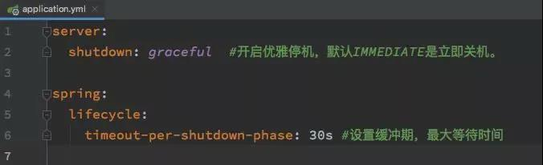

此功能需要springboot2.3.0以上版本支持，访问如下：https://mp.weixin.qq.com/s/vr5eztZQ5T7Tq7MhsP5bxQ

## 2.@RequestParam@PathParam@PathVariable

@RequestParam 和 @PathVariable 注解是用于从request中接收请求的，两个都可以接收参数，关键点不同的是@RequestParam 是从request里面拿取值，而 @PathVariable 是从一个URI模板里面来填充

@RequestParam
看下面一段代码：

http://localhost:8080/springmvc/hello/101?param1=10&param2=20

根据上面的这个URL，你可以用这样的方式来进行获取

public String getDetails(
    @RequestParam(value="param1", required=true) String param1,
        @RequestParam(value="param2", required=false) String param2){

@RequestParam 支持下面四种参数

defaultValue 如果本次请求没有携带这个参数，或者参数为空，那么就会启用默认值
name 绑定本次参数的名称，要跟URL上面的一样
required 这个参数是不是必须的
value 跟name一样的作用，是name属性的一个别名
@PathVariable
这个注解能够识别URL里面的一个模板，我们看下面的一个URL

http://localhost:8080/springmvc/hello/101?param1=10&param2=20
1
上面的一个url你可以这样写：

@RequestMapping("/hello/{id}")
    public String getDetails(@PathVariable(value="id") String id,
    @RequestParam(value="param1", required=true) String param1,
    @RequestParam(value="param2", required=false) String param2){

区别很明显了

@PathParam
这个注解是和spring的pathVariable是一样的，也是基于模板的，但是这个是jboss包下面的一个实现，上面的是spring的一个实现，都要导包

@QueryParam
@QueryParam 是 JAX-RS 本来就提供的，和Spring的RequestParam作用一致

@ResponseBody
responseBody表示服务器返回的时候以一种什么样的方式进行返回， 将内容或对象作为 HTTP 响应正文返回，值有很多，一般设定为json

@RequestBody
一般是post请求的时候才会使用这个请求，把参数丢在requestbody里面


`@RequestParam` 和 `@PathVariable` 注解是用于从request中接收请求的，两个都可以接收参数，关键点不同的是`@RequestParam` 是从request里面拿取值，而 `@PathVariable` 是从一个URI模板里面来填充

`@RequestParam` 和 `@PathVariable` 注解是用于从request中接收请求的，两个都可以接收参数，关键点不同的是`@RequestParam` 是从request里面拿取值，而 `@PathVariable` 是从一个URI模板里面来填充


## 3.参数校验框架：

注意：spring Validated 与hibernate validator的区别

https://blog.csdn.net/aierwa/article/details/94896720

https://blog.csdn.net/steven2xupt/article/details/87452664  应该看这一个，其实hibernate validator框架都不用引入，默认在spring-boot-starter-web启动器里面引入了，但是在比如 baba-item-interface工程，这样的只包含实体及接口，就不适合引入web启动器了，还是引入

```
<dependency>
    <groupId>org.hibernate.validator</groupId>
    <artifactId>hibernate-validator</artifactId>
</dependency>
```


使用校验框架返回的结果，自己写一个统一的拦截器统一处理一下也可以，不写也可以，因为上面的信息，有规律，都是400，如果是400，就解析这样的json数组即可，还是不要后台来写了吧


## 4.导包：

当interface工程需要使用httpservletrequest对象，则是servlet对象，此时我们不要再去找什么servlet依赖了，直接导下面的即可

```xml
<dependency>
    <groupId>org.apache.tomcat.embed</groupId>
    <artifactId>tomcat-embed-core</artifactId>
</dependency>
```

## 5.部署：

打成jar包，目前在公司电脑上使用：java -jar  xxx.jar启动报错，报什么log4j2.yml初始化失败，

```xml
<exclusions>
	<!-- 切换log4j2日志读取，排除springboot默认的logback -->
	<exclusion>
		<groupId>org.springframework.boot</groupId>
		<artifactId>spring-boot-starter-logging</artifactId>
	</exclusion>
    <exclusion>
		<groupId>org.springframework.boot</groupId>
		<artifactId>spring-boot-starter-log4j2</artifactId>
	</exclusion>
</exclusions>
```

当你把以上的两个都屏蔽，启动就停在如下的页面：

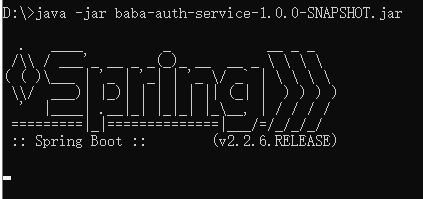

搞了1个小时，是我电脑上别人乱安装jdk导致目前调都调不好的原因，把jar包打好，在别人电脑上一点问题都没有，根本就不用去排除什么log4j的包之类的，也不用添加log4j2.yml文件

## 6.@RequestMapping produces consumes

**为什么我平常不用关注这两个值？**

**因为我定义接口加了@RestController 标这个接口的类，里面定义的方法默认返回都是@ResponseBody，而@ResponseBody的话就是返回json数据**

五、问题

消费的数据，如JSON数据、XML数据都是由我们读取请求的InputStream并根据需要自己转换为相应的模型数据，比较麻烦；

生产的数据，如JSON数据、XML数据都是由我们自己先把模型数据转换为json/xml等数据，然后输出响应流，也是比较麻烦的。

Spring提供了一组注解（@RequestBody、@ResponseBody）和一组转换类（HttpMessageConverter）来完成我们遇到的问题
—————————————
原文链接：https://blog.csdn.net/lzwglory/java/article/details/17252099


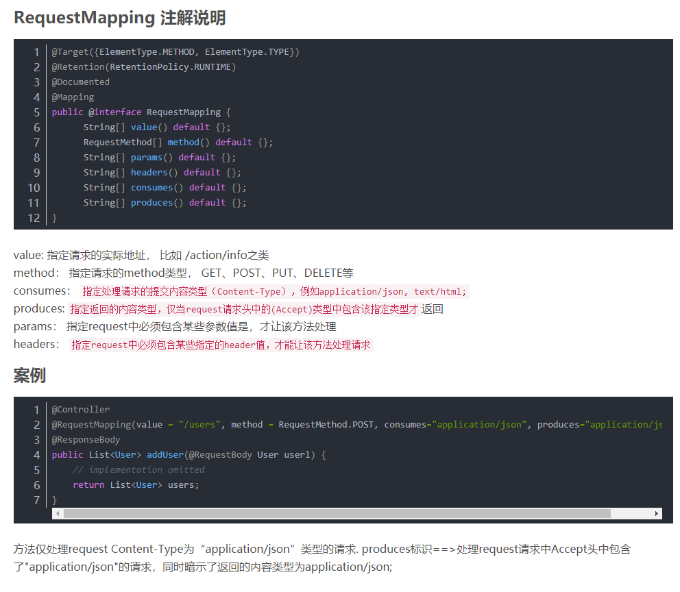
原文链接：https://blog.csdn.net/hbiao68/java/article/details/87366694


1.他的作用是指定返回值类型和返回值编码

2.consumes： 指定处理请求的提交内容类型（Content-Type），例如application/json, text/html;

一、produces的例子

produces第一种使用，返回json数据，下边的代码可以省略produces属性，因为我们已经使用了注解@responseBody就是返回值是json数据：

@Controller  
@RequestMapping(value = "/pets/{petId}", method = RequestMethod.GET, produces="application/json")  
@ResponseBody  
produces第二种使用，返回json数据的字符编码为utf-8.：


@Controller  
@RequestMapping(value = "/pets/{petId}", produces="MediaType.APPLICATION_JSON_VALUE"+";charset=utf-8")  
@ResponseBody  
二、consumes的例子（方法仅处理request Content-Type为“application/json”类型的请求。）

@Controller  
@RequestMapping(value = "/pets", method = RequestMethod.POST, consumes="application/json")

# JDK

经过实验，jdk以后还是不要再使用绿色版本了，安装的比较好，因为安装的jdk有控制面板，可以调很多参数，如下图：

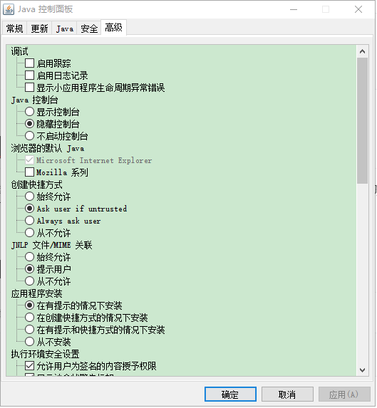

# JAVA

StringUtils里的isEmpty方法和isBlank方法的区别

### **结论**

通过以上代码对比我们可以看出：

  1.isEmpty 没有忽略空格参数，是以是否为空和是否存在为判断依据。


  2.isBlank 是在 isEmpty 的基础上进行了为空（字符串都为空格、制表符、tab 的情况）的判断。（一般更为常用）


# Eureka使用

**端口号指定不能为6位数**

```xml
server:
  port: 10019 #注意此端口号不能指定为6位数，比如100199,否则启动报错
```


# 2.Mybatis Plus使用

## 2.1 目前版本：

​	mybatils plus 3.0.6（经长期使用，目前此版本最稳定）

## 2.2 最新版本bug

2020-04-14 本来想使用最新的3.3.1.tmp版本进行集成，但是使用下面发现LocalDateTime类型不兼容，在数据库里面定义字段类型为datetime,逆向工程自动产生的代码字段类型为：LocalDateTime, 然而在执行如下逻辑时，

```java
@Test
    public void testDictInsert(){
        Dict dict = new Dict();
        dict.setTag("customer_group");
        dict.setTagName("客户分组");
        dict.setRemark("此标签代表客户分组");
        dict.setLevel(true);
        dict.setAvailable(true);
        dict.setIsEdit(true);
        dict.setSortNum(1);
        dict.setCreateById("xiechao");
        dict.setCreateDateTime(LocalDateTime.now());//注意这里
        dict.setUpdateById("xiechao");
        dict.setUpdateDateTime(LocalDateTime.now());

        dictMapper.insert(dict);
    }
```

  

其实这个LocalDateTime问题在Mybatis里面也存在，

百度搜索：mybatis中使用Java8的日期LocalDateTime

 https://blog.csdn.net/weixin_30297281/article/details/95407943 


经过测试，发现是由于数据库驱动问题，

 https://blog.csdn.net/weixin_41564214/article/details/100115996?depth_1-utm_source=distribute.pc_relevant.none-task-blog-BlogCommendFromBaidu-7&utm_source=distribute.pc_relevant.none-task-blog-BlogCommendFromBaidu-7 


我原来使用的是

```xml
<mysql.version>5.1.32</mysql.version>
```

不要再使用这个版本了，都没办法使用最新的Mybatis Plus

<mysql.version>5.1.48</mysql.version> 目前使用这个最新的2020-04-14


因为无法使用最新的3.3.0以上的版本，全局的逻辑删除字段，都都配置

```yaml
mybatis-plus:
  global-config:
    db-config:
      logic-delete-field: flag  #全局逻辑删除字段值 3.3.0开始支持，详情看下面。
      logic-delete-value: 1 # 逻辑已删除值(默认为 1)
      logic-not-delete-value: 0 # 逻辑未删除值(默认为 0)
```

## 2.3 将字段自动更新为null的问题

```java
@Test
    public void testUpdate() {
        User user = new User();
        user.setId("91cfedec25508915f5d78e5b550d3cae");
        user.setUserName("谢超2");
        user.setPassword("123123");
//        userMapper.updateById(user);

//        userMapper.update(user, new UpdateWrapper<>().eq("user_name", "谢超2")));
        userMapper.update(user, new UpdateWrapper<User>().eq("user_name", "谢超2"));

    }
```

经如上测试，新建一个user对象，只对user对象的某1-2个属性赋值，然后执行更新，并不会引起其他的字段更新的null的问题

## 2.4 分页问题

Mybatis Plus的原生接口Ipage分页好用，但自定义xml中的sql分页，需要在mapper导定义的接口第一个参数为page，这样，对代码有很强的侵入，不建议使用，可以考虑集成PageHelper分页插件，一起使用

如下：

```java
// 分页
PageHelper.startPage(page, rows);
// 获取登录用户
UserInfo user = LoginInterceptor.getLoginUser();
// 创建查询条件
Page<Order> pageInfo = (Page<Order>) this.orderMapper.queryOrderList(user.getId(), status);

return new PageResult<>(pageInfo.getTotal(), pageInfo);
```

```
PageHelper.startPage(page, limit);
List<ECustomizeMenuListOutVo> list= eCustomizeMenuMapper.selectListByName(e);
PageInfo<ECustomizeMenuListOutVo> pageList = new PageInfo<>(list);
```

如上，使用很简单，不需要侵入原有代码，只需要在mapper的select之前加入分页信息和之后封装成分页结果即可。

但是要注意startpage方法一定要跟mapper方法连一起。pageInfo对象里可以拿到页码 当前页，记录数，总页数等各种分页查询的结果信息。

## 2.5实现映射一对一，一对多，多对多查询

resultMap实现一对一，一对多，多对多的查询

参考：  https://blog.csdn.net/bll1992/article/details/80456214  


## 空值更新问题

```java
if(customerMapper.insert(customerEntity)>0){
			//保存客户后先保存客户头像
			if(file!=null){
				String photoUrl = HttpClientUtil.uploadCustomerRecordingFile(file, customerEntity.getId());
				System.out.println("客户头像上传后地址：" + photoUrl);
//				CustomerEntity entity = new CustomerEntity();
//				entity.setId(customerEntity.getId());
//				entity.setPhotoUrl(photoUrl);
//				customerMapper.updateById(entity);//只修改一个参数即可，提升程序速度,mybatis plus此版本有个bug，空值更新的问题
				customerEntity.setPhotoUrl(photoUrl);
				customerMapper.updateById(customerEntity);
			}
    
    自动生成的sql语句为：
        UPDATE crm_customer SET delete_user_id=null, delete_date_time=null, sea_type=null, state=null, photo_url='http://files.daliedu.cn//daliedu/crm/call/20a7423374d1d9f3099c11ddad9cd9f1/20200615/20200615389481a9e8c049f683b2d122f0075cbe.jpg' WHERE id='20a7423374d1d9f3099c11ddad9cd9f1'
        很明显有问题，自动更新为null了，而原来我把sea_type,state都是设置为""的，为了避免此问题，以后升级mybatis plus版本，数据库设计没有值的情况，使用0代替，不再使用""空字符串
        
mybatis-plus:  
  # 扫描自定义xml文件路径
  mapper-locations: classpath:mapper/*Mapper.xml
  configuration: 
#    map-underscore-to-camel-case: true #不是通过此配置来解决自动过滤null值属性的问题
    call-setters-on-nulls: true #解决自定义sql返回Map结果，Mybatis plus自动过滤null值属性的问题，我目前集成的sping boot直接返回对象的话，没有null值自动过滤的问题
  global-config:
    db-config:
      logic-delete-value: 1 # 逻辑已删除值(默认为 1)
      logic-not-delete-value: 0 # 逻辑未删除值(默认为 0)
      field-strategy: not-null #解决更新时，空值更新的问题 customerMapper.update(entity, updateWrapper)   entity此对象没设值的属性即为null，如果不配置field-strategy，则会将数据库里面都更新为null
      即使以上配置，也不能解决空值问题
```

# MyBatis

<select id="findSmsList" resultType="java.util.LinkedHashMap" parameterType="String">  建议还是使用LinkedHashMap，因为不仅可以跟数据库表结构一致，还有如下优点：
LinkedHashMap
LinkedHashMap适合于读少写多的场景,因为它的内部是带头结点的单向循环链表,既(有head和tail指针,插入非常块),读的话因为要从头到尾遍历因而缓慢
HashMap适合于读多写少的场景,push的时候无论是RBTree还是list都要设计到部分遍历,因而会导致写的效率一般
    LinkedHashMap适合于读少写多的场景LinkedHashMap适合于读少写多的场景

```
<select id="findSmsList" resultType="java.util.HashMap" parameterType="String">
    	select 
    		<include refid="Alias_Param_Base_Column_List"><property name="alias" value="a"/></include>,
    		b.customer_name as customerName
    	from crm_customer_sms as a left join crm_customer as b on a.customer_id=b.id and a.user_id=#{userId}
    </select>
```


# Swagger使用经验：

## 重大发现：

swagger原生自带参数样例，原来在百度上找一个文章，说没有参数样例，还改继承重写swagger底层代码实现参数样例，真的是误人子弟

```java
    @ApiModelProperty(value = "当前页码", example = "1")
    private Integer pageNum = 1;
    
    @ApiModelProperty(value = "每页显示记录数", example = "10")
    private Integer pageSize = 10;
```

如上：example就是参数样例

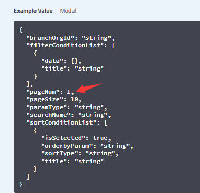

测试时直接有赋予默认值


## 精简使用：

```java
@ApiOperation(value = "修改用户信息")
	@ApiImplicitParams({
		@ApiImplicitParam(name = "userName", value = "姓名", dataType="String"),
        @ApiImplicitParam(name = "mobile", value = "手机", dataType="int"),
        @ApiImplicitParam(name = "email", value = "邮箱", dataType="String"),
        @ApiImplicitParam(name = "password", value = "密码", dataType="String"),
        @ApiImplicitParam(name = "file", value = "文件流对象,接收数组格式", dataType = "MultipartFile",allowMultiple = true)})
	@PostMapping(value = "/update-user-info")
	public Result updateUserInfo(@RequestParam(required=false) String userName, @RequestParam(required=false) Integer mobile, 
			@RequestParam(required=false) String email, @RequestParam(required=false) String password) {}
```

注意只需要声明name,value,dataType就行了，像paramType = "query",可以省略，因为默认就是这个类型，如果你dataType省略，那默认就是String了，这显然不符合我们的要求，注意这个dataType只能写int，而不能写Integer，不知道knife4j里面可不可以写这个，感觉swager还是有很多问题，但貌似knife4j解决了

**还是写全量吧**，可以大面积的copy,省得漏了一个required还得到处找

```java
@ApiOperation(value = "修改用户信息")
	@ApiImplicitParams({
		@ApiImplicitParam(name = "userName", value = "姓名", dataType="String", required=false),
        @ApiImplicitParam(name = "mobile", value = "手机", dataType="int", required=false),
        @ApiImplicitParam(name = "email", value = "邮箱", dataType="String", required=false),
        @ApiImplicitParam(name = "password", value = "密码", dataType="String", required=false),
        @ApiImplicitParam(name = "file", value = "文件流对象,接收数组格式", dataType = "__File", required=false),})
	@PostMapping(value = "/update-user-info")
	public Result updateUserInfo(@RequestParam(required=false) String userName, @RequestParam(required=false) Integer mobile, 
			@RequestParam(required=false) String email, @RequestParam(required=false) String password,
			@RequestParam(required=false, value = "file") MultipartFile file) {}
```


## 使用model封装参数

```java
@ApiOperation(value = "保存客户选择的客户标签及客户标签明细")
	@PostMapping("/save-customer-tag-by-customer-id")
	public Result saveCustomerTagByCustomerId(@ApiParam(value="客户标签json参数模型",required=true)@RequestBody(required=true) CustomerTagGroupModel model) {
		try{
			
			if(model!=null && model.getCustomerTagGroupEntity().size()>0){
				customerTagGroupService.saveCustomerTagByCustomerId(model.getCustomerTagGroupEntity(), model.getCustomerId());
				
	            return Result.success("保存成功");
			}
			return Result.error("请求参数错误");
		}catch (UnauthorizedException e){
			return Result.error(ResultCodeEnum.USER_NOT_AUTH);
		}catch (Exception e) {
			e.printStackTrace();
			return Result.error("保存失败，失败原因：" + e.getMessage());
		}
	}
对应model:
@ApiModel(value="客户标签",description="客户标签所有属性")
@Data
@EqualsAndHashCode(callSuper = false)
@Accessors(chain = true)
public class CustomerTagGroupModel{
	@ApiModelProperty(value="客户ID")
	private String customerId;
	
	@ApiModelProperty(value="客户标签集合")
	private List<CustomerTagGroupEntity> customerTagGroupEntity; //注意这里别定义成CustomerTagGroupEntity[]数组形式了，直接集合就行了
}
```

像上面这种复合参数，可以新建一个model给前端


## @PathVariable @RequestBody同时使用

```
@PathVariable String roleId, @RequestBody @ApiParam(required=true)String[] idList
```

解决@RequestBody  @RequestParam 无法同时使用的问题

@RequestBody与@PathVariable同时存在，但是这样移动端的人，不愿意调用这种拼接url的接口

```java
@ApiOperation(value = "保存客户选择的客户标签及客户标签明细")
	@PostMapping("/save-customer-tag-by-customer-id/{customerId}")
	public Result saveCustomerTagByCustomerId(@ApiParam(value="客户标签json参数模型",required=true)@RequestBody(required=true) CustomerTagGroupEntity[]  model,
			@ApiParam(value="客户ID",required=true)@PathVariable(value = "customerId", required = true) String customerId) {}
```

这种同时使用，就可以直接使用数据库的表作为model，省得去新建model了

## 同时传递多参数与文件

目前未解决,采用转换一下的方式解决

```java
@ApiOperation(value = "新增客户")
	@PostMapping(value = "/save-customer", consumes = "multipart/*", headers = "content-type=multipart/form-data")
	public Result saveCustomer(@ApiParam(value="客户json参数模型",required=true)@RequestParam(required=true) String model, 
			@ApiParam(value="上传的文件",required=true)@RequestParam(required=true, value = "file") MultipartFile file) {
		try{
			Object object = SecurityUtils.getSubject().getPrincipal();
			if (object instanceof UserEntity) {
				UserEntity bean = (UserEntity) object;
				UserEntity user = userService.getById(bean.getId());
				CustomerModel customerModel = null;
				try{
					customerModel = JsonUtil.getJsonToBean(model, CustomerModel.class);//这里转一下解决
				}catch(Exception e){
					return Result.error("app应用端，请求参数出错", model);
				}
				
				
				boolean flag = customerService.saveCustomer(customerModel, file, user);
				if(flag){
					return Result.success("新增客户成功");
				}
				return Result.error("新增客户失败，请联系管理员");
			}
			return Result.error("非法请求");
		}catch (UnauthorizedException e){
			return Result.error(ResultCodeEnum.USER_NOT_AUTH);
		}catch (Exception e) {
			e.printStackTrace();
			return Result.error("新增客户失败，失败原因：" + e.getMessage());
		}
	}
```

传递model参数为(直接复制到swagger接口里面去测就可以了)：

```json
{"customerGroupTypeId":"22","customerIntentionLevel":"*****","customerName":"卡罗拉","customerQuality":"优质","customerSourceNameValue":"湖南在线咨询","customerSourceType":"非代理商","selfDefineItemConfigList":[],"sex":"1"}
```


##  **knife4j:**

从学习knife4j原来下面还可以这么简单的写：

```java
@ApiOperation(value = "修改用户信息")
	@ApiImplicitParams({
		@ApiImplicitParam(name = "userName", value = "姓名", dataType="String"),
        @ApiImplicitParam(name = "mobile", value = "手机", dataType="int"),
        @ApiImplicitParam(name = "email", value = "邮箱", dataType="String"),
        @ApiImplicitParam(name = "password", value = "密码", dataType="String"),
        @ApiImplicitParam(name = "file", value = "文件流对象,接收数组格式", dataType = "MultipartFile",allowMultiple = true)})
	@PostMapping(value = "/update-user-info")
	public Result updateUserInfo(@RequestParam(required=false) String userName, @RequestParam(required=false) Integer mobile, 
			@RequestParam(required=false) String email, @RequestParam(required=false) String password,
			@RequestParam(required=false, value = "file") MultipartFile file) {}
```


https://doc.xiaominfo.com  推荐使用 knife4j 这个是长期有维护的，适用于微服务架构的框架，也是基于swagger


总结：

<groupId>io.github.wilson-he</groupId>

<groupId>com.spring4all</groupId>

从以上的groupId可以看出，这些都是一些个人写的，不过由于只是测试一下接口，对我们的核心业务不会造成影响，倒是可以使用个人写的，其他的主要框架严禁采用个人写的，主要是没质量保证


https://blog.csdn.net/z28126308/article/details/84187221 此博客介绍了集成zull的使用方式

<dependency>
		<groupId>io.github.wilson-he</groupId>
		<artifactId>swagger2-spring-boot-starter</artifactId>
		<version>1.1.0</version>
	</dependency>
io.github.wilson-he 从这个看出，为个人所写，稳定性，或者bug可能存疑，不过在yml中配置支持多模块，确实很不错


https://blog.csdn.net/weixin_37509652/article/details/80094370

一：swagger是什么？
1、是一款让你更好的书写API文档的规范且完整框架。

2、提供描述、生产、消费和可视化RESTful Web Service。

3、是由庞大工具集合支撑的形式化规范。这个集合涵盖了从终端用户接口、底层代码库到商业API管理的方方面面。

方法一：使用第三方依赖（最简单的方法）
1、在pom.xml文件中添加第三方swagger依赖（）

	<dependency>
		<groupId>com.spring4all</groupId>  注意这是一个社区，目前提供的组件也比较少
		<artifactId>swagger-spring-boot-starter</artifactId>
		<version>1.9.1.RELEASE</version>
	</dependency>
2、在Spring Boot项目的启动类上添加@EnableSwagger2Doc注解，就可以直接使用啦。
3、https://github.com/SpringForAll/spring-boot-starter-swagger这是GitHub上这个swagger依赖实现的项目，里面有详细的讲解。

方法二：使用官方依赖
1、在pom.xml文件中添加swagger相关依赖
        <dependency>
            <groupId>io.springfox</groupId>
            <artifactId>springfox-swagger2</artifactId>
            <version>2.7.0</version>
        </dependency>
        <dependency>
            <groupId>io.springfox</groupId>
            <artifactId>springfox-swagger-ui</artifactId>
            <version>2.7.0</version>
        </dependency>

第一个是API获取的包，第二是官方给出的一个ui界面。这个界面可以自定义，默认是官方的，对于安全问题，以及ui路由设置需要着重思考。


## 支持扫描多包：

https://www.jianshu.com/p/b5068f121a49   已经整合在 baba-org模块中


## 参数语法：

```
@ApiImplicitParams({
        @ApiImplicitParam(name = "orgId", dataType ="String", required = false, value = "组织结构编号，不传返回整个树形组织结构，传则返回指定的树形结构"),
        @ApiImplicitParam(name = "orgName", type = "String", value = "组织机构名称", defaultValue = "")
})
```

required = false,可不写，默认就是false

dataType与type都是指定数据类型，统一使用 Integer String Long这些代替吧


## 单文件上传model传参：

注意下面的单文件上传，无法传递非常多的参数，只能一个一个去定义参数，无法像下面这样,Customer这个是无法直接传进去的

```java
public Result saveCustomer(@ApiParam(value="客户json参数模型",required=true)@RequestBody(required=true) Customer model, 
			@ApiParam(value="上传的文件",required=true)@RequestParam(required=false, value = "file") MultipartFile file) 
```

目前想了一种解决办法：这个model对应一整个字符串，如下：

```json
{"customerGroupTypeId":"22","customerIntentionLevel":"*****","customerName":"卡罗拉","customerQuality":"优质","customerSourceNameValue":"湖南在线咨询","customerSourceType":"非代理商","selfDefineItemConfigList":[],"sex":"1"}
```

```java
public Result saveCustomer(@ApiParam(value="客户json参数模型",required=true)@RequestParam(required=true) String model, 
			@ApiParam(value="上传的文件",required=true)@RequestParam(required=false, value = "file") MultipartFile file) 
```

对于接收的参数使用如下转换：

```java
CustomerModel customerModel = JsonUtil.getJsonToBean(model, CustomerModel.class);
```


## 单文件上传：

单文件上传简写(**推荐使用这种，已经测试过**)：

```java
@ApiOperation(value = "修改用户信息")
	@ApiImplicitParams({
		@ApiImplicitParam(name = "userName", value = "姓名", dataType="String", required=false),
        @ApiImplicitParam(name = "mobile", value = "手机", dataType="int", required=false),
        @ApiImplicitParam(name = "email", value = "邮箱", dataType="String", required=false),
        @ApiImplicitParam(name = "password", value = "密码", dataType="String", required=false),
        @ApiImplicitParam(name = "file", value = "文件流对象,接收数组格式", dataType = "__File", required=false),})
	@PostMapping(value = "/update-user-info")
	public Result updateUserInfo(@RequestParam(required=false) String userName, @RequestParam(required=false) Integer mobile, 
			@RequestParam(required=false) String email, @RequestParam(required=false) String password,
			@RequestParam(required=false, value = "file") MultipartFile file) {}
```


参考文档：

http://zhoulizhi6.gitee.io/blog/2019/11/20/1/  此文比较好

https://gitee.com/xiaoym/swagger-bootstrap-ui-demo/blob/master/swagger-bootstrap-ui-demo/src/main/java/com/swagger/bootstrap/ui/demo/controller/UploadController.java    此文较详细

```java
@ApiOperation(value = "单独保存客户通话录音文件，给移动端app使用")
//	@ApiImplicitParams({
//			@ApiImplicitParam(paramType = "query", dataType = "String", name = "userCustomerCallId", value = "用户客户通话唯一ID", required = true),
//			@ApiImplicitParam(paramType = "query", dataType = "__file", name = "file", value = "需要导入的客户数据的excel文件", required = true)
//			})
//	@RequiresPermissions("sys:role:list")
	@PostMapping(value = "/saveCallRecordingFile", headers = "content-type=multipart/form-data") 
	//@PostMapping(value = "/saveCallRecordingFile", consumes = "multipart/*", headers = "content-type=multipart/form-data")//注意consumes = "multipart/*"这个我没加，也可以在swagger上上传成功
	public Result saveCallRecordingFile(
			@ApiParam(value="用户客户通话唯一ID",required=true)@RequestParam(required=true) String userCustomerCallId, 
			@ApiParam(value="上传的文件",required=true)@RequestParam(required=true, value = "file") MultipartFile file) {
        
    }
```

注意，使用了文件上传，参数的声明就只能使用@ApiParam来声明，这样在swagger接口测试页面上才可以选择文件进行测试成功

上面的@ApiImplicitParams 这些就不能用了，因为无论声明dataType = "__file"，还是 dataType = "file"我都没成功

如下图：


## 多文件上传：

knife4j 以及swagger-bootstrap-ui   使用这个swagger-bootstrap-ui  应该是支持的

https://gitee.com/xiaoym/swagger-bootstrap-ui-demo/blob/master/swagger-bootstrap-ui-demo/src/main/java/com/swagger/bootstrap/ui/demo/controller/UploadController.java  


以下的方法都不支持，后续考虑使用knife4j 框架应该是支持多文件的

```java
@ApiOperation(value = "测试多文件上传【经测试，多文件上传，无论怎么调整files在swagger页面上，都是传递为空值】")
	@PostMapping(value = "/testSaveCallRecordingFile", consumes = "multipart/*", headers = "content-type=multipart/form-data")//注意consumes = "multipart/*"这个我没加，也可以在swagger上上传成功
	public Result testSaveCallRecordingFile(
			@ApiParam(value="用户客户通话唯一ID",required=true)@RequestParam(required=true) String userCustomerCallId, 
			@ApiParam(value="上传的文件",required=true)@RequestPart(required=true, value = "files") MultipartFile[] files) {
		try{
			for(MultipartFile file : files){
				System.out.println(file.getName());
			}
			return Result.success("保存成功");
		}catch (Exception e) {
			e.printStackTrace();
			return Result.error("上传录音文件失败，失败原因：" + e.getMessage());
		}
	}
```

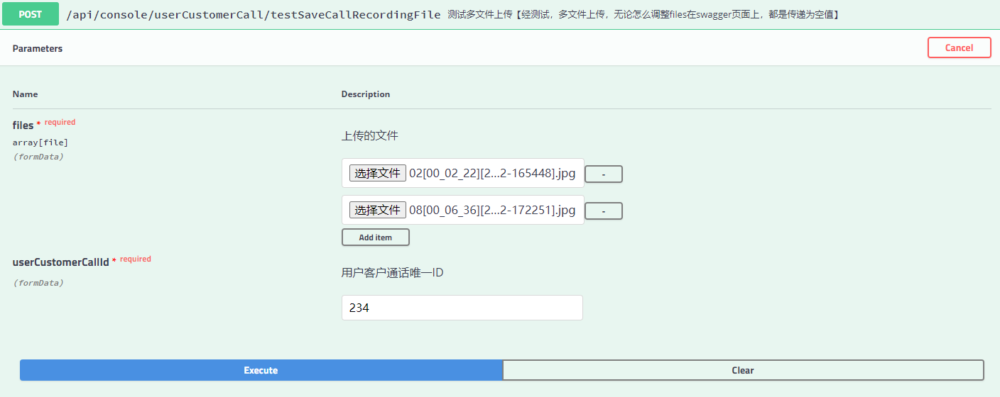

无论使用 @RequestPart还是 @RequestParam，后端接收swagger页面上传过来的files都是空值，网上这个文章

https://www.cnblogs.com/dzcWeb/p/7842993.html  这个说可以，但我是没调成功

**注意**：下面 consumes = "multipart/form-data"，上面是写成 consumes = "multipart/*"


```java
// 在@RequestMapping中添加consumes = "multipart/form-data"可以支持多文件数组上传，否则Swagger将自动将Content-Type设置
	// 为application/json，但设置之后Swagger还是无法选择多个文件进行接口测试的，只是显示可以传递文件数组，这时可以采用Postman
	// 或RestClient等接口测试工具进行接口测试，多文件上传建议使用@ApiParam注解
	@ApiOperation(value = "更新用户信息3")
	@RequestMapping(value = "/updateUser3", method = RequestMethod.POST, consumes = "multipart/form-data")
	@ResponseBody
	public ResponseEntity<String> updateUser3(
			@ApiParam(value = "用户头像列表", name = "userLogos", required = true) MultipartFile[] userLogos) {
		for (MultipartFile userLogo : userLogos) {
			String userLogoName = userLogo.getOriginalFilename();
			System.out.println(userLogoName);
		}
		return ResponseEntity.ok("OK");
	}
```

下面的为支持多文件的写法，不支持swagger上测试

```java
@ApiOperation(value = "添加跟进记录,支持多文件上传(只支持上传*.jpg,*.bmp,*.png格式文件)，注：多文件上传，不支持swagger页面上测试", notes="注：多文件上传，不支持swagger页面上测试")
	@ApiImplicitParams({
	        @ApiImplicitParam(name = "files",value = "多个文件，",paramType = "formData",allowMultiple=true,required = false,dataType = "file"),
	        @ApiImplicitParam(paramType = "query", dataType = "String", name = "dynamicContent", value = "用户填写的跟进日志,动态内容", required = true),
	        @ApiImplicitParam(paramType = "query", dataType = "String", name = "customerId", value = "客户ID", required = true)})
	@PostMapping(value = "/insertFollowLogFile", headers = "content-type=multipart/form-data")
	public Result insertFollowLogFile(HttpServletRequest request, @RequestParam(required = true) String dynamicContent, @RequestParam(required = true) String customerId,
			@RequestParam(value = "files", required = false) MultipartFile[] files) {
			
			}
```

```java
//即使只声明一个参数，swagger页面上也是不支持多文件上传的
public Result testSaveCallRecordingFile(
			//@ApiParam(value="用户客户通话唯一ID",required=true)@RequestParam(required=true) String userCustomerCallId, 
			@ApiParam(value="上传的文件",required=true)@RequestParam(required=true, value = "files") MultipartFile[] files) {｝
```


# Json相关

1. 不要使用fastjson，漏洞太多，速度也不见得比jackJson快多少，最主要是jackjson是springboot的默认集成中间件，一切还是以spring为准，spring集成的是哪个，哪个肯定是比较优秀的
2. 默认无值的话，比如CustomerEntity中，很多属性没值的情况下，传给前端还是设置为null,  比如这个客户里面还有customerTagList这种集合，或者数组的对象，如果没有内容的话，也统统为null吧，做到统一
3. 

# Git及GitHub使用经验：

下载github上的单个文件夹：

方法1：使用 http://kinolien.github.io/gitzip/ 访问此网站，注意需要先下载访问token


方法2：借助gitzip-for-github的chrome插件，不过需要谷歌访问助手翻墙，上面那个方式，直接下载，不需要配置翻墙

http://www.cnplugins.com/devtool/gitzip-for-github/


# Maven使用经验：

## 1.接口工程

接口工程中，不需要引入如下的插件：因为这种工程没有启动类

```xml
	<build>
        <plugins>
            <plugin>
                <groupId>org.springframework.boot</groupId>
                <artifactId>spring-boot-maven-plugin</artifactId>
            </plugin>
        </plugins>
    </build>
```

像baba-auth-common，baba-common这种工程，都不需要如上的配置，但是，一定要有如下的声明：

```xml
<packaging>jar</packaging>
```

**否则，在打包时候，会报引入这个工程报错**，这种你在idea里面开发，根本就不会报错，你用maven打包的时候就一定会报错


## 2.POM聚合工程

是一个聚合工程，如:

​	baba-user-->

​						baba-user-interface

​						baba-user-service

则此时打包方式为，使用baba-user打包，而不是单独去打baba-user-interface或者baba-user-service，单独打会报错，由此类推，可以对顶级聚合工程baba打包，这样，所有的子模块，可以一次性打包完成

## 3.标签说明

```xml
<dependency>
    <groupId>org.projectlombok</groupId>
    <artifactId>lombok</artifactId>
    <optional>true</optional> 注意这里的区分
</dependency>
```

# [maven optional可选依赖](https://www.cnblogs.com/chenweichu/p/6349478.html)

应用场景：projectA 依赖projectB,  projectB 依赖projectC时

```xml
<dependency>
  <groupId>com.itear.projectC</groupId>
  <artifactId>projectC</artifactId>
  <version>0.0.1-SNAPSHOT</version>
  <optional>true</optional>
</dependency>
```

当projectB的<optional>true</optional>时, projectA中如果没有显式的引入projectC, 则projectA不依赖projectC, 即projectA可以自己选择是否依赖projectC

默认<optional>的值为false, 及子项目必须依赖, **我的理解就是切断引用的作用**

## 4.仓库地址配置

```xml
<mirrors>
	 <mirror>
        <id>aliyun</id>
        <name>aliyun Maven</name>
        <mirrorOf>*</mirrorOf>
        <url>http://maven.aliyun.com/nexus/content/groups/public/</url>
    </mirror>
  </mirrors>
```

<!-- <mirrorOf>*</mirrorOf> *代表，无论你在项目中引入什么jar包,都会使用你配置的这个mirror仓库去下载，如果你使用一些第三方的jar包，那么就会下载不下来，这就是为什么我之前无法将快照版本的elaticsearch-data 4.0RC版本下载下来的原因 -->

其实应该把<mirror></mirror>节点全部注掉，应该通过<profiles>节点来配置，如下：

```xml
<profiles>
    <profile>
       <id>nexus-aliyun</id>
       <repositories>
			<repository>
                 <id>nexus-aliyun</id>
                 <url>http://maven.aliyun.com/nexus/content/groups/public/</url>
                 <releases>
                    <enabled>true</enabled>
                 </releases>
                 <snapshots>
                    <enabled>true</enabled>
                 </snapshots>
            </repository>
       </repositories>           
       <pluginRepositories>
			<pluginRepository>
				<id>nexus-aliyun</id>
				<url>http://maven.aliyun.com/nexus/content/groups/public/</url>
				<releases>
					<enabled>true</enabled>
				</releases>
				<snapshots>
					<enabled>true</enabled>
				</snapshots>
			</pluginRepository>
        </pluginRepositories>
    </profile>
    <profile>
       <id>bintray</id>
       <repositories>
			<repository>
                 <id>bintray</id>
                 <url>http://dl.bintray.com/andimarek/graphql-java</url>
                 <releases>
                    <enabled>true</enabled>
                 </releases>
                 <snapshots>
                    <enabled>false</enabled>
                 </snapshots>
            </repository>
       </repositories>           
       <pluginRepositories>
			<pluginRepository>
				<id>bintray</id>
				<url>http://dl.bintray.com/andimarek/graphql-java</url>
				<releases>
					<enabled>true</enabled>
				</releases>
				<snapshots>
					<enabled>false</enabled>
				</snapshots>
			</pluginRepository>
        </pluginRepositories>
    </profile>
	<profile>
       <id>dev-daliedu</id>
       <repositories>
			<repository>
            <!--central,3rd party,apache-snapshots,release,daliedu-dev-release,daliedu-dev-snapshots -->
                 <id>daliedu-dev-group</id>
                 <url>http://192.168.10.145:8081/nexus/content/groups/daliedu-dev-group/</url>
                 <releases>
                    <enabled>true</enabled>
                 </releases>
                 <snapshots>
                    <enabled>true</enabled>
                 </snapshots>
            </repository>
       </repositories>           
       <pluginRepositories>
			<pluginRepository>
				<id>daliedu-dev-group</id>
				<url>http://192.168.10.145:8081/nexus/content/groups/daliedu-dev-group/</url>
				<releases>
					<enabled>true</enabled>
				</releases>
				<snapshots>
					<enabled>true</enabled>
				</snapshots>
			</pluginRepository>
        </pluginRepositories>
    </profile>
  </profiles>

<activeProfiles>
        <activeProfile>nexus-aliyun</activeProfile>
		<activeProfile>bintray</activeProfile>
		<activeProfile>dev-daliedu</activeProfile>
</activeProfiles>
```

<!-- 上面profiles是配置仓库列表，activeProfiles是配置激活， -->

比如上面的graphql-java，就是一个第三方的对graphql的实现，如果不这样配仓库，将无法下载到这个java实现


# 分布式文件系统：

各种文件系统比较：

​	https://www.cnblogs.com/linkenpark/p/10234855.html

常见的分布式文件系统有，GFS、HDFS、Lustre 、Ceph 、GridFS 、mogileFS、TFS、FastDFS等。各自适用于不同的领域。它们都不是系统级的分布式文件系统，而是应用级的分布式文件存储服务。

tfs的官网目前都打不开了，而且网上对接spring的使用教程也好少

fastDFS目前只有2016年最后一个5.0.8的版本，也4年没更新了

官网：https://sourceforge.net/projects/fastdfs/

java客户端：

```xml
<dependency>
    <groupId>com.github.tobato</groupId>  可根据此下载最新的客户端，客户端则一直在更新，2020年的都有
    <artifactId>fastdfs-client</artifactId>
</dependency>
```

经过比较，分布式文件系统，只有fastDFS与HDFS是可选的方案


### [FastDFS和集中存储方式对比](https://www.cnblogs.com/fanblogs/p/11086744.html)

 

| 指标                   | FastDFS | NFS    | 集中存储设备 如NetApp、NAS |
| ---------------------- | ------- | ------ | -------------------------- |
| 线性扩容性             | 高      | 差     | 差                         |
| 文件高并发访问性能     | 高      | 差     | 一般                       |
| 文件访问方式           | 专有API | POSIX  | 支持POSIX                  |
| 硬件成本               | 较低    | 中等   | 高                         |
| 相同内容文件只保存一份 | 支持    | 不支持 | 不支持                     |

分布式存储与传统的SAN、NAS相比，优势如下：

1、性能

在分布式存储达到一定规模是，性能会超过传统的SAN、NAS。大量磁盘和节点，结合适当的数据分布策略，可以达到非常高的聚合带宽。传统的SAN、NAS都会有性能瓶颈，一旦达到最大扩展能力，性能不会改变甚至降低。

2、价格: 传统的SAN、NAS，价格比较高。特别是SAN网络设备，光纤网络成本比较高。而且，以后扩展还需要增加扩展柜。成本太高。分布式存储只需要IP网络，几台X86服务器加内置硬盘就可以组建起来，初期成本比较低。扩展也非常方便，加服务器就行。

3、可持续性: 传统的SAN、NAS扩展能力受限，一个机头最多可以带几百个磁盘。如果想要个PB以上的共享存储，分布式存储只最好的选择。不用担心扩展能力问题。

缺点：

1、需要比较强的技术能力和运维能力，甚至有开发能力的用户。传统存储开箱即用，硬件由厂家提供，也有完善的文档和服务。而分布式很多是开源或者是有公司基于开源系统提供支持服务，版本迭代比较快，出问题后有可能需要自己解决。

2、数据一致性问题。对于ORACLE RAC这一类对数据一致性要求比较高的应用场景，分布式存储的性能可能就稍弱了，因为分布式的结构，数据同步是一个大问题，虽然现在技术一致在进步，但是也不如传统存储设备数据存储方式可靠。

3、稳定性问题，分布式存储非常依赖网络环境和带宽，如果网络发生抖动或者故障，都可能会影响分布式存储系统运行。例如，一旦发生IP冲突，那么整体分布式存储可能都无法访问。传统存储一般使用专用SAN或IP网络，稳定性方面，更可靠一些。


# ElasticSearch搜索引擎使用：

网上已经有很多收费的7.x的视频了（目前spring boot data elasticsearch只有3.x的版本，支持elastic7.x的需要匹配4.x的版本，目前还是预览版，没有正式版）

不能使用spring-boot-starter-data-elasticsearch则不能使用ElasticsearchTemplate，将不是很方便了，不过可以将elasticSearch的版本变为6.x即可使用这个启动器，不过我目前刚开始使用，肯定不能使用过时的产品

https://eelve.com/archives  Elastic Stack实战之Kibana初体验（可以看看）

文档：

elasticsearch7完全开发指南

​	https://wenku.baidu.com/view/8ff2ce94591b6bd97f192279168884868762b8e7.html

SpringBoot集成Elasticsearch7.4 实战（一），下面这个链接有一个系列的

https://www.jianshu.com/p/1fbfde2aefa5

https://www.jianshu.com/p/acc8e86cc772

https://eelve.com/archives/kibana

https://blog.csdn.net/chengyuqiang/article/details/86015411

https://blog.csdn.net/weixin_34190136/article/details/91446546

https://blog.csdn.net/jeffli1993/article/details/102579286

https://blog.csdn.net/pyq666/article/details/99639810

https://www.lizenghai.com/archives/43887.html

https://blog.csdn.net/miaomiao19971215/article/details/105106783


Elasticsearch也是基于Lucene的全文检索库，本质也是存储数据，很多概念与MySQL类似的。

对比关系：


索引（indices）--------------------------------Databases 数据库

​	类型（type）-----------------------------Table 数据表

​	     文档（Document）----------------Row 行

​		   字段（Field）-------------------Columns 列 


solr:

主要功能列表包括：

- 全文搜索
- 突出
- 分面搜索
- 实时索引
- 动态群集
- 数据库集成
- NoSQL功能和丰富的文档处理（例如Word和PDF文件）

ElasticSearch:

主要功能列表包括：

- 分布式搜索

- 多租户

- 分析搜索

- 分组和聚合

  - 分布式，无需人工搭建集群（solr就需要人为配置，使用Zookeeper作为注册中心）

  - Restful风格，一切API都遵循Rest原则，容易上手

  - 近实时搜索，数据更新在Elasticsearch中几乎是完全同步的。

    

安装与使用：

​	官网下载

​			elasticsearch-7.6.2-windows-x86_64.zip 

​			kibana-7.6.2-windows-x86_64.zip

启动文件：

D:\ProgramFiles\elasticsearch-7.6.2-windows-x86_64\elasticsearch-7.6.2\bin\elasticsearch.bat

查看启动是否成功：http://localhost:9200/

Kibana控制台：http://127.0.0.1:5601

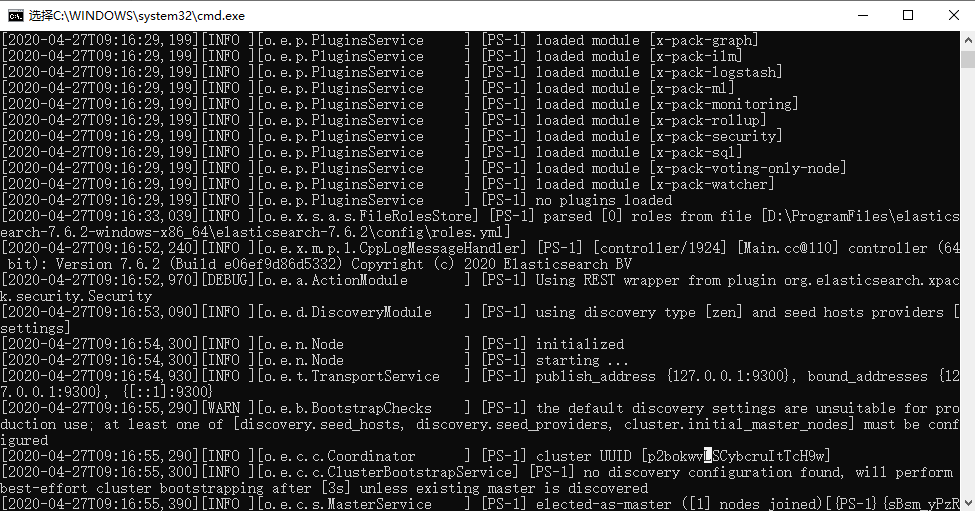


windows版本启动到  no plugins loaded时会卡住，按enter回车，即可继续运行


### windows环境下elasticsearch安装教程(超详细)

https://www.cnblogs.com/hualess/p/11540477.html

### 插件安装：

#### 安装分词器：

参考文档：https://blog.csdn.net/wsms007/article/details/86569285 windows安装

因为我使用的是7.6.2版本，所以需要安装此版本的分词器，注意版本必需完全一致

安装命令如下：

elasticsearch-plugin install https://github.com/medcl/elasticsearch-analysis-ik/releases/download/v7.6.2/elasticsearch-analysis-ik-7.6.2.zip

安装完成，需要重启，重启可在控制台上看到刚刚安装的插件ikAnalysis分词器


#### head插件

，这个是之前的学习教程里面没有的https://www.sojson.com/blog/85.html

https://github.com/mobz/elasticsearch-head 

作为Elasticsearch的插件运行（已弃用）我选择的是chrome插件运行，不过要翻墙才能安装好

安装后的界面如下图：

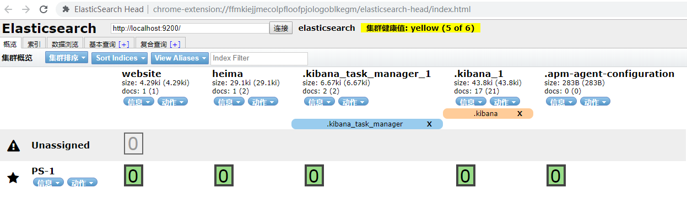


# nginx使用：

> ### 使用

nginx可以通过命令行来启动，操作命令：

- 启动：`start nginx.exe`

- 停止：`nginx.exe -s stop`

- 重新加载：`nginx.exe -s reload`

  

windows无法启动，报80端口占用的问题，找了好久，终于找到原因（本地安装sql server数据库导致）：

https://www.cnblogs.com/caiyt/p/10118481.html

启动nginx.exe之后

nginx: [emerg] bind() to 0.0.0.0:80 failed (10013: An attempt was made to access a socket in a way forbidden by its access permissions)

说明某个进程占用了80端口

查看之后是System占用，这个是系统服务，无法手动终止

原因是 **SQL Server Reporting Services**，停止掉这个服务并设置其为手动启动即可

启动好nginx后，在重新启动SQL Server Reporting Services服务可以启动成功，但是未验证微软的数据库报表设计工具，它集成在微软的商业智能开发工具是否能正常使用。


## 使用本地目录做图片服务器：

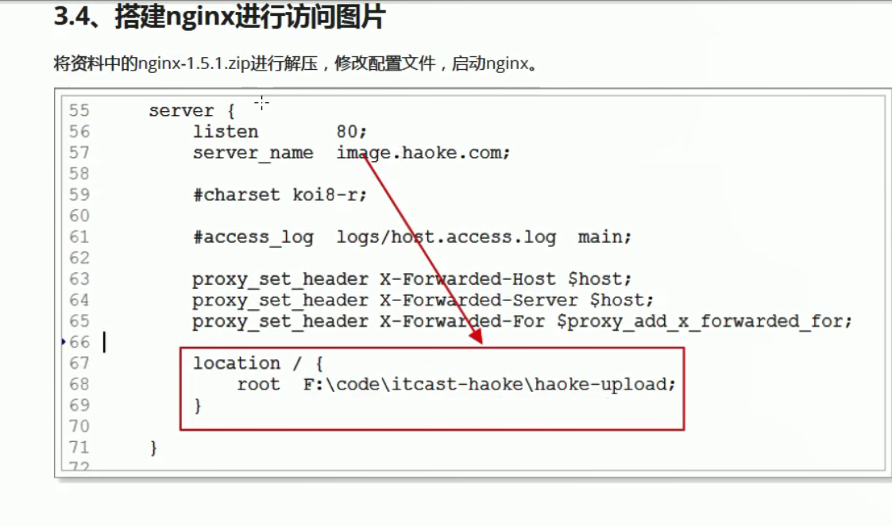

访问路径如下：

http://image.haoke.com/images/2018/11/12/20181112xxxx.jpg   而此文件存储在

F:\code\itcast-haoke\haoke-upload\


## 如何在NGINX中部署多个前端项目

https://blog.csdn.net/kielin/article/details/94459660


# redis使用经验：

Spring Data Redis 提供了一个工具类：RedisTemplate。里面封装了对于Redis的五种数据结构的各种操作，包括：

使用StringRedisTemplate也是一样的操作，还自动序列化

- redisTemplate.opsForValue() ：操作字符串
- redisTemplate.opsForHash() ：操作hash
- redisTemplate.opsForList()：操作list
- redisTemplate.opsForSet()：操作set
- redisTemplate.opsForZSet()：操作zset

其它一些通用命令，如expire，可以通过redisTemplate.xx()来直接调用

5种结构：

- String：等同于java中的，`Map<String,String>`
- list：等同于java中的`Map<String,List<String>>`
- set：等同于java中的`Map<String,Set<String>>`
- sort_set：可排序的set
- hash：等同于java中的：`Map<String,Map<String,String>>

# 3.数据库设计经验

https://item.taobao.com/item.htm?spm=a21ka.8063459.319593.40.44f55602C0ofx0&id=8720562031
https://item.jd.com/4155894.html#product-detail
从以上淘宝，京东的商品详情页的地址可以看出，京东使用提自增的搞法，淘宝使用的是自研的算法id来生成商品的id
下一次做项目，所有id都采用uuid不要再采用别的了，如果你的项目做了分库分表，数据迁移，使用自增，都玩不转了，**像订单id还是可以采用雪花算法来做**


## 强烈建议不要使用自增

**使用主键自增，在本地开发环境上频繁测试新增，删除，对于已经上线的系统，升级很容易导致主键冲突**


## 一对多数据返回

像一对多的数据返回，应该使用json结构一对多的返回方式，切记不要使用 select * from a, b where a.id=b.id这种搞法，同时将多表的数据混合在一起给组装成json返回了

应该是如下的结构：

```json
{
  "code": 0,
  "msg": "OK",
  "data": [
    {
      "customerTagTypeId": 1,
      "customerTagGroupDetailList": [
        {
          "customerTagId": 1,
          "customerTagTypeId": 1,
          "customerTagName": "个人客户",
          "remark": null,
          "orderNum": 1,
          "createBy": "2",
          "updateBy": "2",
          "createTime": "2019-10-25 13:58:15",
          "updateTime": null
        },
        {
          "customerTagId": 2,
          "customerTagTypeId": 1,
          "customerTagName": "团购客户",
          "remark": null,
          "orderNum": 2,
          "createBy": "2",
          "updateBy": "2",
          "createTime": "2019-10-30 16:04:55",
          "updateTime": null
        }
      ],
      "branchOrgId": "",
      "customerTagTypeName": "客户类型",
      "remark": null,
      "orderNum": 0,
      "createBy": "1",
      "updateBy": "1",
      "createTime": "2019-10-28 15:44:58",
      "updateTime": null,
      "isInit": true
    }
  ]
}
Response headers
 access-control-allow-cred
```


## **一对一的表，比如订单状态表的主键可以直接来自于订单表**

一对一的表，也可以设计成关联表，比如订单表--》订单状态表
一个订单，只会存在一个状态，但是为什么要设计一个订单状态表呢？

```mysql
DROP TABLE IF EXISTS `tb_order_status`;
CREATE TABLE `tb_order_status`  (
  `order_id` bigint(20) NOT NULL COMMENT '订单id',  主键直接来自订单表
  `status` int(1) NULL DEFAULT NULL COMMENT '状态：1、未付款 2、已付款,未发货 3、已发货,未确认 4、交易成功 5、交易关闭 6、已评价',
  `create_time` datetime(0) NULL DEFAULT NULL COMMENT '订单创建时间',
  `payment_time` datetime(0) NULL DEFAULT NULL COMMENT '付款时间',
  `consign_time` datetime(0) NULL DEFAULT NULL COMMENT '发货时间',
  `end_time` datetime(0) NULL DEFAULT NULL COMMENT '交易完成时间',
  `close_time` datetime(0) NULL DEFAULT NULL COMMENT '交易关闭时间',
  `comment_time` datetime(0) NULL DEFAULT NULL ON UPDATE CURRENT_TIMESTAMP(0) COMMENT '评价时间',
  PRIMARY KEY (`order_id`) USING BTREE,
  INDEX `status`(`status`) USING BTREE
) ENGINE = InnoDB CHARACTER SET = utf8 COLLATE = utf8_general_ci COMMENT = '订单状态表' ROW_FORMAT = Compact;
```

因为订单的状态，会经常修改

设计了一个spu_detail表，里面的字段，全是商品描述，商品详情等大字段，当我只需要查看比如购物车商品时，这些大字段，就不需要查出来了，影响效率
这个也是一对一的关联表

```mysql
DROP TABLE IF EXISTS `tb_stock`;
CREATE TABLE `tb_stock`  (
  `sku_id` bigint(20) NOT NULL COMMENT '库存对应的商品sku id',
  `seckill_stock` int(9) NULL DEFAULT 0 COMMENT '可秒杀库存',
  `seckill_total` int(9) NULL DEFAULT 0 COMMENT '秒杀总数量',
  `stock` int(9) NOT NULL COMMENT '库存数量',
  PRIMARY KEY (`sku_id`) USING BTREE
) ENGINE = InnoDB CHARACTER SET = utf8 COLLATE = utf8_general_ci COMMENT = '库存表，代表库存，秒杀库存等信息' ROW_FORMAT = Compact;
```


也是频繁更新，所以库存表，也独立成一张表

## 如何在高并发的分布式系统中产生UUID

## 分布式系统ID的几种生成办法

https://www.cnblogs.com/huchong/p/11400888.html  此文非常详细


每一次都请求数据库，通过数据库的自增ID来获取全局唯一ID
对于小系统来说，这是一个简单有效的方案，不过也就不符合讨论情形中的高并发的场景。
首先，数据库自增ID需要锁表
而且，UUID的生成强依赖于数据库，每次获取UUID都需要经过一次数据库的调用，性能损耗很大。
其实，在这种大并发的场景中，数据库的主键都不建议使用数据库的自增ID。因为虽然这个简单，但是如果随着业务发展，需要对原有的数据进行重新分库分表的时候，可能会产生主键冲突，这影响了系统的平滑扩容，容易埋下坑。 


注意，原来的蓝凌没解决主键问题，是因为没采用雪花算法，使用的是随机数算法，即使是10位也会容易出现重复的


### UUID是否适合做分布式id：

如果需求是只保证唯一性，那么UUID也是可以使用的，但是按照上面的分布式id的要求， UUID其实是不能做成分布式id的，原因如下：

> 1. 首先分布式id一般都会作为主键，但是安装mysql官方推荐主键要尽量越短越好，UUID每一个都很长，所以不是很推荐
> 2. 既然分布式id是主键，然后主键是包含索引的，然后mysql的索引是通过b+树来实现的，每一次新的UUID数据的插入，为了查询的优化，都会对索引底层的b+树进行修改，因为UUID数据是无序的，所以每一次UUID数据的插入都会对主键地城的b+树进行很大的修改，这一点很不好
> 3. 信息不安全：基于MAC地址生成UUID的算法可能会造成MAC地址泄露，这个漏洞曾被用于寻找梅丽莎病毒的制作者位置。

### 那么UUID可以用到哪些方面呢

比如阿里云每一条短信发送的唯一id，这个是可以的，比如从阿里云官网截图所示：
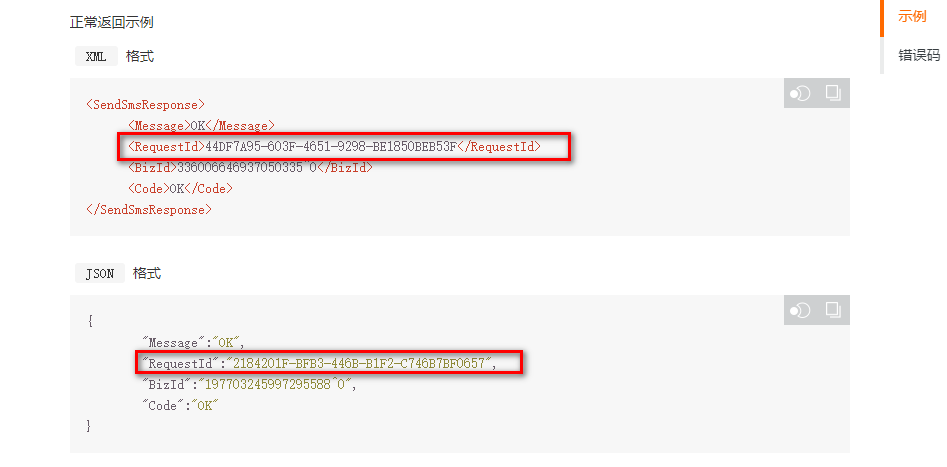


## 创建唯一索引，用户名不可重复

```mysql
CREATE TABLE t_user  (
  `id` bigint(20) NOT NULL AUTO_INCREMENT,
  `username` varchar(50) CHARACTER SET utf8 COLLATE utf8_general_ci NOT NULL COMMENT '用户名',
  `password` varchar(32) CHARACTER SET utf8 COLLATE utf8_general_ci NOT NULL COMMENT '密码，加密存储',
  `phone` varchar(20) CHARACTER SET utf8 COLLATE utf8_general_ci NULL DEFAULT NULL COMMENT '注册手机号',
  `created` datetime(0) NOT NULL COMMENT '创建时间',
  `salt` varchar(32) CHARACTER SET utf8 COLLATE utf8_general_ci NOT NULL COMMENT '密码加密的salt值',
  PRIMARY KEY (`id`) USING BTREE,
  UNIQUE KEY `username`(`username`) USING BTREE
) ENGINE = InnoDB AUTO_INCREMENT = 29 CHARACTER SET = utf8 COLLATE = utf8_general_ci COMMENT = '用户表' ROW_FORMAT = Compact;	
```


## 左连接，右连接，各种连接的区别：

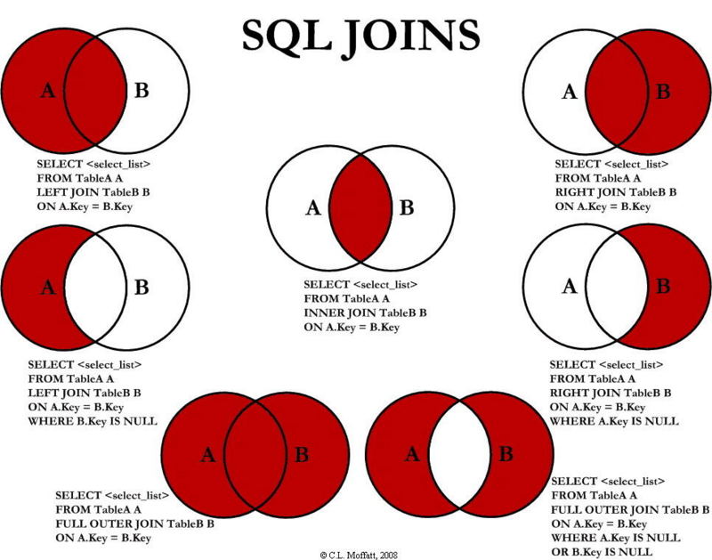

默认使用inner join,即不写inner join 直接select * from a, b where 

以后写sql都使用左连接吧
```xml
<select id="searchUsers" resultMap="BaseResultMap">
        SELECT a.id as id ,a.create_time as create_time, a.create_by as create_by,a.update_time as update_time,a.update_by as update_by
        ,a.user_id as user_id,a.password as password,a.realname as realname,a.type as type,a.mobile as mobile
        ,a.email as email,a.remarks as remarks ,a.status as status,a.avatar as avatar,a.sex as sex
        ,c.name as role_name,c.role_id as role_role_id ,e.org_id as org_id,e.simple_name as simple_name,g.code as code,g.url as url
        from sys_user a
        LEFT JOIN  sys_user_role b on a.user_id=b.user_id
        LEFT JOIN  sys_role c on b.role_id=c.role_id
        LEFT JOIN sys_user_org d on a.user_id=d.user_id
        left JOIN sys_org e on d.org_id =e.org_id
        left join sys_role_menu f on f.role_id=c.role_id
        left join sys_menu g on g.code=f.menu_code
        <where>
            <if test="userId != null and userId!='' ">
                a.user_id = #{userId}
            </if>
            <if test="realname != null and realname!='' ">
                AND a.realname = #{realname}
            </if>
        </where>
    </select>
```


## 为空字段设计：

如果想设计比如某一个字段没有值就不属于分校，比如branchOrgId为""则不属于任何分校，以后还是不要这样设计了，因为为空的话，在数据库里面有很多种，比如"" null 等，
以后还是使用为0来代替吧，0也是没有的意思，因为设计为0的话，在写查询条件的时候，也好写一些，与前台进行接口对接也好对接一些，你的接口还可以设计默认值为0

## 组织节点设计：

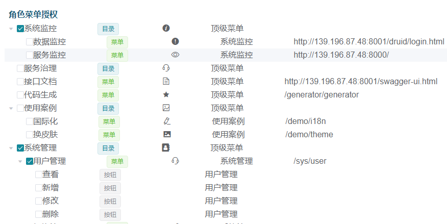

如上图，可以只显示节点，而不用勾选下面的权限

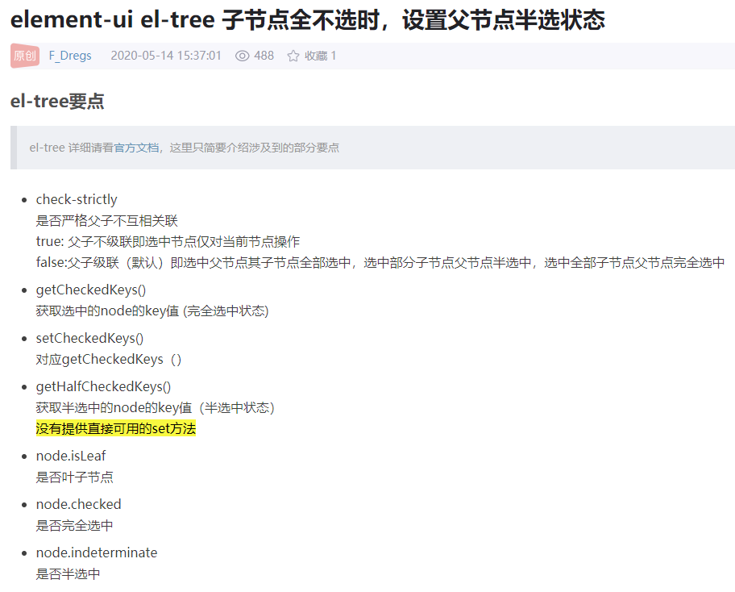

貌似比较麻烦，还是设计一个查看节点吧，比如系统设置，这个下层就不用增加一个查看节点了，这种查看节点，只添加在最下层即可，比如系统设置下面的，你一个二级节点都没选，那么没有系统设置也是应该的

## 数据字典设计：


像这种设计简直就是失败，根本就不需要设置什么值，什么名称值就是什么，如果是这样设计，那么怎么跟下面这种挂起来呢？千万不能什么名称，存到客户表就存什么名称，万一数据字典名称改了，你怎么去同步将客户表中的这个数据字典名称给改掉？

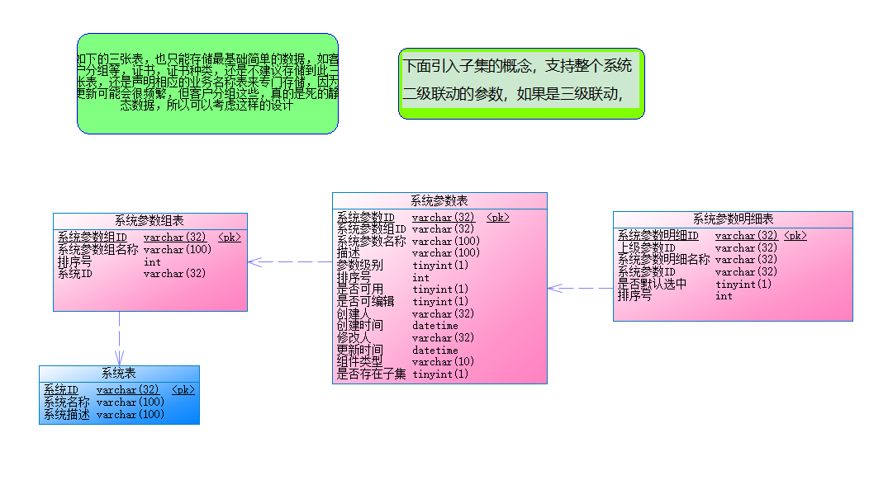

遇到的问题就是：比如客户表只存储数据字典里面参数明细ID,那么当向前端返回结果集的时候，是需要翻译给前端去展现的？？？ 怎么办？

前端自己去翻译，一般是在修改客户的时候，去自己翻译一下进行默认选中，这种批量查询10条，50条，100条，还是后端设置数据库非映射字段进行翻译好给前端进行回显吧

@TableField(exist = false)
private String customerTagName;


## 千万级数据库分页优化

今天接到一个五千万的数据库文件，需要洗一遍数据，洗数据的时候遇到两个问题

原始数据没有主键 需要手动添加
ALTER TABLE `tablename` ADD COLUMN `id`  int(11) NOT NULL AUTO_INCREMENT FIRST ,ADD PRIMARY KEY (`id`);

5000万数据大概执行了十五分钟左右

limit 查询数据变慢
优化查询语句由

select * from `tablename` limit 10000, 1000

改为

select * from `tablename` where id >10000000  limit 0, 1000

这样修改后查询效率由原来的8s左右变为1s以内

分析 ： mysql分页查询是先把分页之前数据都查询出来了，然后截取后把不是分页的数据给扔掉后得到的结果。所以数据量太越大分页越慢。
但是我们可以先把需要分页的id查询出来，因为id是主键id主键索引，查询起来还是快很多的，然后根据id连接查询对应的分页数据

**上述问题，也只能应付一下面试，你有这种数据去分段查询的思路就行了，真正的千万级数据，肯定不是这么简单的，要么搜索引擎，要么分库分表在做了**


## 字段设计为""的问题

以后再也不要把数据库的某一列设置为空值，即"",来代表没有，或者不属于的意思了，出现了太多空值转换的问题，如果要有这种需求，直接设计为
varchar(2)  里面存储0即可，像这种最好还是使用int来存储


## 大表拆分小表

比如一个客户表，一个订单表，是可以将大字段单独设计到一张表里面去，使用客户ID关联，使用订单ID关联即可，这样可以增加查询效率


# 事务：

## springboot全局事务

```java
@Override
	public boolean saveCustomerFlowOperationConfig(CustomerFlowOperationConfigJson[] arrList) throws Exception{
		// 逻辑为： 先删除已经存在的所有配置数据，再新增
		customerFlowOperationConfigMapper.deleteAllData();
		
		for(CustomerFlowOperationConfigJson json : arrList){
			for(String operationType : json.getOperationType()){
				CustomerFlowOperationConfigEntity entity = new CustomerFlowOperationConfigEntity();
				entity.setOperationCause(json.getOperationCause());
				entity.setOperationCauseId(json.getOperationCauseId());
				entity.setOperationType(operationType);
				
				customerFlowOperationConfigMapper.insert(entity);
			}
		}
		
		return true;
	}
```

注意，如果此方法没有声明： throws Exception，那么即使，下面的.insert(entity);代码报错，则上面已经删除的数据，将不会回滚，TransactionAdviceConfig.java这种声明式全局事务处理，还是不太好用


# MyCat:

Mycat就是一个解决数据库分库分表等问题的数据库中间件，也可以理解为是数据库代理。在架构体系中是位于数据库和应用层之间的一个组件，Mycat 实现了 Mysql 的原生协议，对于应用它感知不到连接了 Mycat，因为从协议来讲，两者是一样的。而Mycat将应用的请求转发给它后面的数据库，对应用屏蔽了分库分表的细节。Mycat的三大功能：**分表、读写分离、主从切换**。

下图通过 Mycat schema 配置和实际 DB 部署来简要说明 Mycat 分库分表功能的实现：

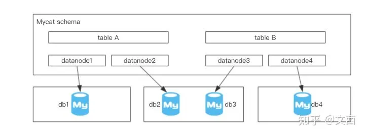

例如表 A，配置中它有两个数据节点，分别是  datanode1 和 datanode2，含义是逻辑表 A实际对应了两个物理存储，分别是 db1 和 db2。对于应用而言，应用连接 Mycat 感知到的时候逻辑表 A，而在底层 A 被拆分，存储在两个 db 中。

## 主从同步延迟解决方案：

https://www.cnblogs.com/A121/p/10471895.html    [MySQL主从复制延迟解决方案](https://www.cnblogs.com/A121/p/10471895.html)

https://blog.51cto.com/szk5043/1762981  Mysql主从同步延迟问题及解决方案


# MySQL:

## 枚举类型：

mysql数据库里面的枚举类型，使用逆向工程生成java实体类，java里面对应的是String与之匹配，而

enum('0','1','2','3')     对应java   String

tinyint(1)                     对应java  Boolean

**注意：**站在 mysql的角度，尽量多用集合！

但是站在php操作mysql的角度，尽量少用！（兼容性差）

`type` enum('0','1','2','3') CHARACTER SET utf8 COLLATE utf8_general_ci NOT NULL DEFAULT '0' COMMENT '活动类型，目前可选的有：0没有促销，1满减，2满额送抵扣券，3秒杀',

还是不要使用这种类型，如果换库的话，应该不麻烦，oracle与之对应使用varchar即可，但是关键就在于扩充，比如这个字段，我现在添加一个4，代表抢购，是需要alter 表结构中的这个字段的，那可是相当的麻烦，你直接使用int,你想使用哪个数字代表啥就代表啥，**枚举就限定死了，一定好，就只能存储指定的值**


## 伪列，创建ID序列问题

如下的 (@i:=@i+1) as num 创建伪列，虽然可实现一个序列，但是如果使用分页的话，计数还是从1开始，前台拿到这样的数据，如果需要连接的话，就会有问题，不过这种小功能，可以前台去解决

```xml
select (@i:=@i+1) as num, vip_id, coalesce(vip_type,"") as vip_type, coalesce(push_money_count,0) as push_money_count from (  

		select  vip_id, vip_type, sum(push_money_count) as push_money_count from  (
		<!--查询我的提成-->
			select 
				a.vip_id as vip_id,c.vip_type as vip_type,
				round(sum(transaction_amount*(push_money_ratio/100)),2) as  push_money_count
			from crm_customer_vip a,crm_project_vip b,crm_vip c 
				where a.id=b.customer_id and a.vip_id=c.id and b.state='7'  and a.deleted='0' and b.deleted='0' group by vip_id
		
		union all
		<!--查询我的下线给我创造的提成-->
			select 
				c.parent_id as vip_id,c.vip_type as vip_type,
					round(sum(transaction_amount*
						(select cast(value as SIGNED INTEGER)  from crm_sys_dict where type='push_ratio')/100),2) as push_money_count
			from crm_customer_vip a,crm_project_vip b,crm_vip c 
				where a.id=b.customer_id and a.vip_id=c.id and b.state='7'  and a.deleted='0' and b.deleted='0'   and a.vip_id in 
					(select id from crm_vip   where parent_id!=0)  group by vip_id
		<!--查询人工维护的代理商会员的提成-->
		union all
			select vip_id,vip_type,push_money_count from crm_vip_top100_temp
					)  as t  group by vip_id order by push_money_count desc 
					
		) as tt, (select  @i:=0) as num
		<if test="orderbyParam !=null and orderbyParam !='null' and orderbyParam !=''">
			order by ${orderbyParam}  ${sortType}
		</if>
			limit #{startRow}, #{pageSize}
	</select>
```


# WebSocket分布式：

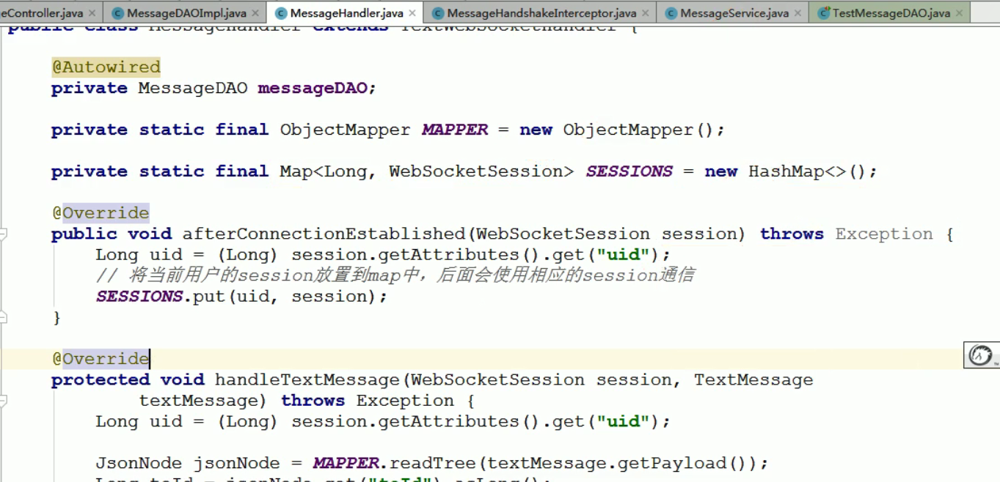

把图中的websocket对象放入redis中，而不是放到像现在的Map集合中，来做分布式，这种方案听起来好像是行得通的，但实际做下来，是行不通的，因为：这个websocket这个对象，是一个保持在线的对象，是无法序列化的

解决方案：通过消息系统来解决

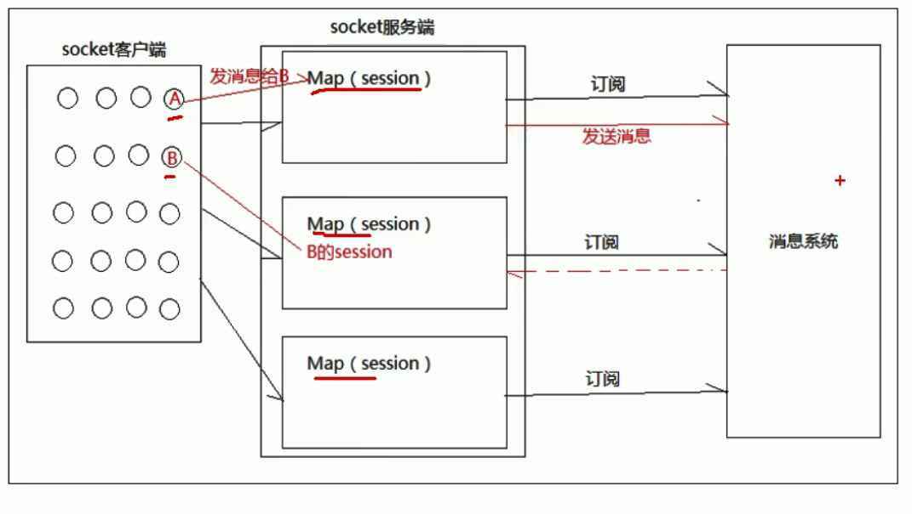


