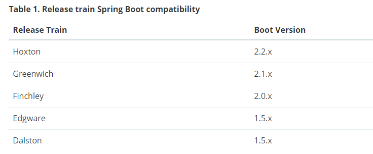
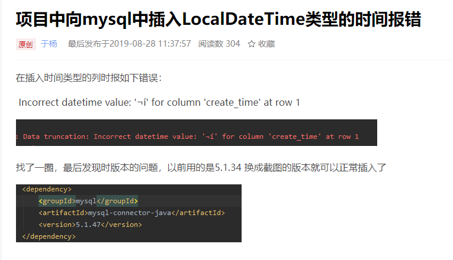
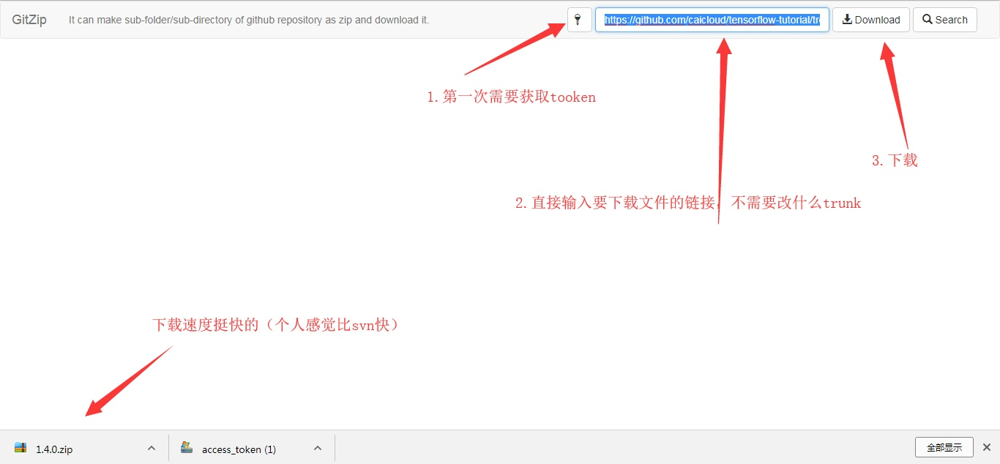

# 开发记录

技术博客：

http://blog.didispace.com 优秀博客

http://www.itmuch.com 优秀博客

https://www.cnblogs.com/huanzi-qch/p/10249227.html

# 端口及域名设计：

说明：

​		后面带两个0的，设计容量为100台，如10100，10101，10102，10103为一个集群，此设计足够支撑超大型的并发了，如果还有一个别的大型服务，可以考虑采用20100，以2字打头再命名，先暂时采用如下设计方案

gateway-service网关服务:10100      网关压力比较大，必需规划容量为100台

registry-service服务注册中心:10010    规划10台即可

user-service用户服务：10200

order-service订单服务：10300

item-service商品服务:10400

search-service搜索引擎服务:10500

goods-web-service商品静态页面服务：10600

secskill-service秒杀服务：10700

upload-service文件上传服务：10800

sms-service短信服务：10900

cart-service购物车服务：11100

org-service组织架构服务：11200   


域名设计：

C:\Windows\System32\drivers\etc\hosts 文件中增加如下内容（Linux下的hosts文件所在路径： /etc/hosts ）：

127.0.0.1 localhost

127.0.0.1 www.baba.com	一级域名
127.0.0.1 manage.baba.com	二级域名，后台管理
127.0.0.1 api.baba.com	二级域名，api服务
127.0.0.1 image.leyou.com	二级域名，图片服务


# 0.待开发列表

1.集成PageHelper，不要使用Mybatis Plus支持的xml自定义sql语句分页功能

2.动态表单，可以借鉴乐优的规格参数表的设计模式（初步设计稿，是下面的思路）

​	可采用：模板表--》表单组表--》表单明细表

​	客户表（客户id,客户name,表单明细json) 查询的话，全部走搜索引擎来查

3. sleuth 链路追踪 zipkin 延迟分析

# 1.框架版本

​	集成使用的是

​		springboot	2.2.6  

​		springcloud 	Finchley.SR2 

​		mybatils plus 	3.0.6（经长期使用，目前此版本最稳定）

​		连接池	Hikari（springboot默认使用此连接池）



以上为springcloud官方网站提供的springcloud与springboot匹配版本对应表，切记一定严格按照此配对使用

# springboot使用

@RequestParam，@PathParam，@PathVariable等注解区别

@RequestParam 和 @PathVariable 注解是用于从request中接收请求的，两个都可以接收参数，关键点不同的是@RequestParam 是从request里面拿取值，而 @PathVariable 是从一个URI模板里面来填充

@RequestParam
看下面一段代码：

http://localhost:8080/springmvc/hello/101?param1=10&param2=20

根据上面的这个URL，你可以用这样的方式来进行获取

public String getDetails(
    @RequestParam(value="param1", required=true) String param1,
        @RequestParam(value="param2", required=false) String param2){

@RequestParam 支持下面四种参数

defaultValue 如果本次请求没有携带这个参数，或者参数为空，那么就会启用默认值
name 绑定本次参数的名称，要跟URL上面的一样
required 这个参数是不是必须的
value 跟name一样的作用，是name属性的一个别名
@PathVariable
这个注解能够识别URL里面的一个模板，我们看下面的一个URL

http://localhost:8080/springmvc/hello/101?param1=10&param2=20
1
上面的一个url你可以这样写：

@RequestMapping("/hello/{id}")
    public String getDetails(@PathVariable(value="id") String id,
    @RequestParam(value="param1", required=true) String param1,
    @RequestParam(value="param2", required=false) String param2){

区别很明显了

@PathParam
这个注解是和spring的pathVariable是一样的，也是基于模板的，但是这个是jboss包下面的一个实现，上面的是spring的一个实现，都要导包

@QueryParam
@QueryParam 是 JAX-RS 本来就提供的，和Spring的RequestParam作用一致

@ResponseBody
responseBody表示服务器返回的时候以一种什么样的方式进行返回， 将内容或对象作为 HTTP 响应正文返回，值有很多，一般设定为json

@RequestBody
一般是post请求的时候才会使用这个请求，把参数丢在requestbody里面

# Eureka使用

**端口号指定不能为6位数**

```xml
server:
  port: 10019 #注意此端口号不能指定为6位数，比如100199,否则启动报错
```


# 2.Mybatis Plus使用

## 2.1 目前版本：

​	mybatils plus 3.0.6（经长期使用，目前此版本最稳定）

## 2.2 最新版本bug

2020-04-14 本来想使用最新的3.3.1.tmp版本进行集成，但是使用下面发现LocalDateTime类型不兼容，在数据库里面定义字段类型为datetime,逆向工程自动产生的代码字段类型为：LocalDateTime, 然而在执行如下逻辑时，

```java
@Test
    public void testDictInsert(){
        Dict dict = new Dict();
        dict.setTag("customer_group");
        dict.setTagName("客户分组");
        dict.setRemark("此标签代表客户分组");
        dict.setLevel(true);
        dict.setAvailable(true);
        dict.setIsEdit(true);
        dict.setSortNum(1);
        dict.setCreateById("xiechao");
        dict.setCreateDateTime(LocalDateTime.now());//注意这里
        dict.setUpdateById("xiechao");
        dict.setUpdateDateTime(LocalDateTime.now());

        dictMapper.insert(dict);
    }
```

  

其实这个LocalDateTime问题在Mybatis里面也存在，

百度搜索：mybatis中使用Java8的日期LocalDateTime

 https://blog.csdn.net/weixin_30297281/article/details/95407943 




经过测试，发现是由于数据库驱动问题，

 https://blog.csdn.net/weixin_41564214/article/details/100115996?depth_1-utm_source=distribute.pc_relevant.none-task-blog-BlogCommendFromBaidu-7&utm_source=distribute.pc_relevant.none-task-blog-BlogCommendFromBaidu-7 


我原来使用的是

```xml
<mysql.version>5.1.32</mysql.version>
```

不要再使用这个版本了，都没办法使用最新的Mybatis Plus

<mysql.version>5.1.48</mysql.version> 目前使用这个最新的2020-04-14


因为无法使用最新的3.3.0以上的版本，全局的逻辑删除字段，都都配置

```yaml
mybatis-plus:
  global-config:
    db-config:
      logic-delete-field: flag  #全局逻辑删除字段值 3.3.0开始支持，详情看下面。
      logic-delete-value: 1 # 逻辑已删除值(默认为 1)
      logic-not-delete-value: 0 # 逻辑未删除值(默认为 0)
```

## 2.3 将字段自动更新为null的问题

```java
@Test
    public void testUpdate() {
        User user = new User();
        user.setId("91cfedec25508915f5d78e5b550d3cae");
        user.setUserName("谢超2");
        user.setPassword("123123");
//        userMapper.updateById(user);

//        userMapper.update(user, new UpdateWrapper<>().eq("user_name", "谢超2")));
        userMapper.update(user, new UpdateWrapper<User>().eq("user_name", "谢超2"));

    }
```

经如上测试，新建一个user对象，只对user对象的某1-2个属性赋值，然后执行更新，并不会引起其他的字段更新的null的问题

## 2.4 分页问题

Mybatis Plus的原生接口Ipage分页好用，但自定义xml中的sql分页，需要在mapper导定义的接口第一个参数为page，这样，对代码有很强的侵入，不建议使用，可以考虑集成PageHelper分页插件，一起使用

如下：

```java
// 分页
PageHelper.startPage(page, rows);
// 获取登录用户
UserInfo user = LoginInterceptor.getLoginUser();
// 创建查询条件
Page<Order> pageInfo = (Page<Order>) this.orderMapper.queryOrderList(user.getId(), status);

return new PageResult<>(pageInfo.getTotal(), pageInfo);
```

```
PageHelper.startPage(page, limit);
List<ECustomizeMenuListOutVo> list= eCustomizeMenuMapper.selectListByName(e);
PageInfo<ECustomizeMenuListOutVo> pageList = new PageInfo<>(list);
```

如上，使用很简单，不需要侵入原有代码，只需要在mapper的select之前加入分页信息和之后封装成分页结果即可。

但是要注意startpage方法一定要跟mapper方法连一起。pageInfo对象里可以拿到页码 当前页，记录数，总页数等各种分页查询的结果信息。

## 2.5实现映射一对一，一对多，多对多查询

resultMap实现一对一，一对多，多对多的查询

参考：  https://blog.csdn.net/bll1992/article/details/80456214  


# Swagger使用经验：

总结：

<groupId>io.github.wilson-he</groupId>

<groupId>com.spring4all</groupId>

从以上的groupId可以看出，这些都是一些个人写的，不过由于只是测试一下接口，对我们的核心业务不会造成影响，倒是可以使用个人写的，其他的主要框架严禁采用个人写的，主要是没质量保证


https://blog.csdn.net/z28126308/article/details/84187221 此博客介绍了集成zull的使用方式

<dependency>
		<groupId>io.github.wilson-he</groupId>
		<artifactId>swagger2-spring-boot-starter</artifactId>
		<version>1.1.0</version>
	</dependency>
io.github.wilson-he 从这个看出，为个人所写，稳定性，或者bug可能存疑，不过在yml中配置支持多模块，确实很不错


https://blog.csdn.net/weixin_37509652/article/details/80094370

一：swagger是什么？
1、是一款让你更好的书写API文档的规范且完整框架。

2、提供描述、生产、消费和可视化RESTful Web Service。

3、是由庞大工具集合支撑的形式化规范。这个集合涵盖了从终端用户接口、底层代码库到商业API管理的方方面面。

方法一：使用第三方依赖（最简单的方法）
1、在pom.xml文件中添加第三方swagger依赖（）

	<dependency>
		<groupId>com.spring4all</groupId>  注意这是一个社区，目前提供的组件也比较少
		<artifactId>swagger-spring-boot-starter</artifactId>
		<version>1.9.1.RELEASE</version>
	</dependency>
2、在Spring Boot项目的启动类上添加@EnableSwagger2Doc注解，就可以直接使用啦。
3、https://github.com/SpringForAll/spring-boot-starter-swagger这是GitHub上这个swagger依赖实现的项目，里面有详细的讲解。

方法二：使用官方依赖
1、在pom.xml文件中添加swagger相关依赖
        <dependency>
            <groupId>io.springfox</groupId>
            <artifactId>springfox-swagger2</artifactId>
            <version>2.7.0</version>
        </dependency>
        <dependency>
            <groupId>io.springfox</groupId>
            <artifactId>springfox-swagger-ui</artifactId>
            <version>2.7.0</version>
        </dependency>

第一个是API获取的包，第二是官方给出的一个ui界面。这个界面可以自定义，默认是官方的，对于安全问题，以及ui路由设置需要着重思考。


## 支持扫描多包：

https://www.jianshu.com/p/b5068f121a49   已经整合在 baba-org模块中


## 参数语法：

```
@ApiImplicitParams({
        @ApiImplicitParam(name = "orgId", dataType ="String", required = false, value = "组织结构编号，不传返回整个树形组织结构，传则返回指定的树形结构"),
        @ApiImplicitParam(name = "orgName", type = "String", value = "组织机构名称", defaultValue = "")
})
```

required = false,可不写，默认就是false

dataType与type都是指定数据类型，统一使用 Integer String Long这些代替吧

# Git及GitHub使用经验：

下载github上的单个文件夹：

方法1：使用 http://kinolien.github.io/gitzip/ 访问此网站，注意需要先下载访问token




方法2：借助gitzip-for-github的chrome插件，不过需要谷歌访问助手翻墙，上面那个方式，直接下载，不需要配置翻墙

http://www.cnplugins.com/devtool/gitzip-for-github/


# nginx使用：

> ### 使用

nginx可以通过命令行来启动，操作命令：

- 启动：`start nginx.exe`

- 停止：`nginx.exe -s stop`

- 重新加载：`nginx.exe -s reload`

  

windows无法启动，报80端口占用的问题，找了好久，终于找到原因（本地安装sql server数据库导致）：

https://www.cnblogs.com/caiyt/p/10118481.html

启动nginx.exe之后

nginx: [emerg] bind() to 0.0.0.0:80 failed (10013: An attempt was made to access a socket in a way forbidden by its access permissions)

说明某个进程占用了80端口

查看之后是System占用，这个是系统服务，无法手动终止

原因是 **SQL Server Reporting Services**，停止掉这个服务并设置其为手动启动即可

启动好nginx后，在重新启动SQL Server Reporting Services服务可以启动成功，但是未验证微软的数据库报表设计工具，它集成在微软的商业智能开发工具是否能正常使用。


# redis使用经验：

Spring Data Redis 提供了一个工具类：RedisTemplate。里面封装了对于Redis的五种数据结构的各种操作，包括：

使用StringRedisTemplate也是一样的操作，还自动序列化

- redisTemplate.opsForValue() ：操作字符串
- redisTemplate.opsForHash() ：操作hash
- redisTemplate.opsForList()：操作list
- redisTemplate.opsForSet()：操作set
- redisTemplate.opsForZSet()：操作zset

其它一些通用命令，如expire，可以通过redisTemplate.xx()来直接调用

5种结构：

- String：等同于java中的，`Map<String,String>`
- list：等同于java中的`Map<String,List<String>>`
- set：等同于java中的`Map<String,Set<String>>`
- sort_set：可排序的set
- hash：等同于java中的：`Map<String,Map<String,String>>

# 3.数据库设计经验

## **一对一的表，比如订单状态表的主键可以直接来自于订单表**

一对一的表，也可以设计成关联表，比如订单表--》订单状态表
一个订单，只会存在一个状态，但是为什么要设计一个订单状态表呢？

```mysql
DROP TABLE IF EXISTS `tb_order_status`;
CREATE TABLE `tb_order_status`  (
  `order_id` bigint(20) NOT NULL COMMENT '订单id',  主键直接来自订单表
  `status` int(1) NULL DEFAULT NULL COMMENT '状态：1、未付款 2、已付款,未发货 3、已发货,未确认 4、交易成功 5、交易关闭 6、已评价',
  `create_time` datetime(0) NULL DEFAULT NULL COMMENT '订单创建时间',
  `payment_time` datetime(0) NULL DEFAULT NULL COMMENT '付款时间',
  `consign_time` datetime(0) NULL DEFAULT NULL COMMENT '发货时间',
  `end_time` datetime(0) NULL DEFAULT NULL COMMENT '交易完成时间',
  `close_time` datetime(0) NULL DEFAULT NULL COMMENT '交易关闭时间',
  `comment_time` datetime(0) NULL DEFAULT NULL ON UPDATE CURRENT_TIMESTAMP(0) COMMENT '评价时间',
  PRIMARY KEY (`order_id`) USING BTREE,
  INDEX `status`(`status`) USING BTREE
) ENGINE = InnoDB CHARACTER SET = utf8 COLLATE = utf8_general_ci COMMENT = '订单状态表' ROW_FORMAT = Compact;
```

因为订单的状态，会经常修改

设计了一个spu_detail表，里面的字段，全是商品描述，商品详情等大字段，当我只需要查看比如购物车商品时，这些大字段，就不需要查出来了，影响效率
这个也是一对一的关联表

```mysql
DROP TABLE IF EXISTS `tb_stock`;
CREATE TABLE `tb_stock`  (
  `sku_id` bigint(20) NOT NULL COMMENT '库存对应的商品sku id',
  `seckill_stock` int(9) NULL DEFAULT 0 COMMENT '可秒杀库存',
  `seckill_total` int(9) NULL DEFAULT 0 COMMENT '秒杀总数量',
  `stock` int(9) NOT NULL COMMENT '库存数量',
  PRIMARY KEY (`sku_id`) USING BTREE
) ENGINE = InnoDB CHARACTER SET = utf8 COLLATE = utf8_general_ci COMMENT = '库存表，代表库存，秒杀库存等信息' ROW_FORMAT = Compact;
```


也是频繁更新，所以库存表，也独立成一张表

## 如何在高并发的分布式系统中产生UUID

每一次都请求数据库，通过数据库的自增ID来获取全局唯一ID
对于小系统来说，这是一个简单有效的方案，不过也就不符合讨论情形中的高并发的场景。
首先，数据库自增ID需要锁表
而且，UUID的生成强依赖于数据库，每次获取UUID都需要经过一次数据库的调用，性能损耗很大。
其实，在这种大并发的场景中，数据库的主键都不建议使用数据库的自增ID。因为虽然这个简单，但是如果随便业务发展，需要对原有的数据进行重新分库分表的时候，可能会产生主键冲突，这影响了系统的平滑扩容，容易埋下坑。 


注意，原来的蓝凌没解决主键问题，是因为没采用雪花算法，使用的是随机数算法，即使是10位也会容易出现重复的


## 创建唯一索引，用户名不可重复

```mysql
CREATE TABLE t_user  (
  `id` bigint(20) NOT NULL AUTO_INCREMENT,
  `username` varchar(50) CHARACTER SET utf8 COLLATE utf8_general_ci NOT NULL COMMENT '用户名',
  `password` varchar(32) CHARACTER SET utf8 COLLATE utf8_general_ci NOT NULL COMMENT '密码，加密存储',
  `phone` varchar(20) CHARACTER SET utf8 COLLATE utf8_general_ci NULL DEFAULT NULL COMMENT '注册手机号',
  `created` datetime(0) NOT NULL COMMENT '创建时间',
  `salt` varchar(32) CHARACTER SET utf8 COLLATE utf8_general_ci NOT NULL COMMENT '密码加密的salt值',
  PRIMARY KEY (`id`) USING BTREE,
  UNIQUE KEY `username`(`username`) USING BTREE
) ENGINE = InnoDB AUTO_INCREMENT = 29 CHARACTER SET = utf8 COLLATE = utf8_general_ci COMMENT = '用户表' ROW_FORMAT = Compact;	
```
